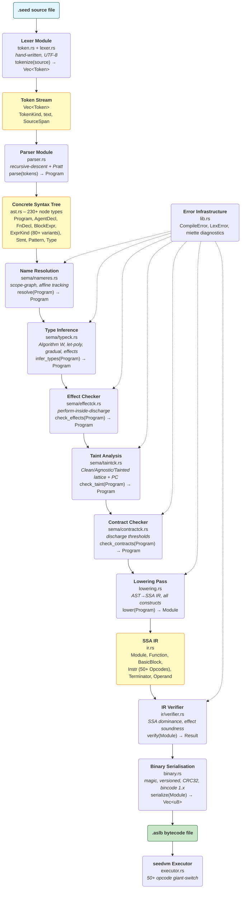
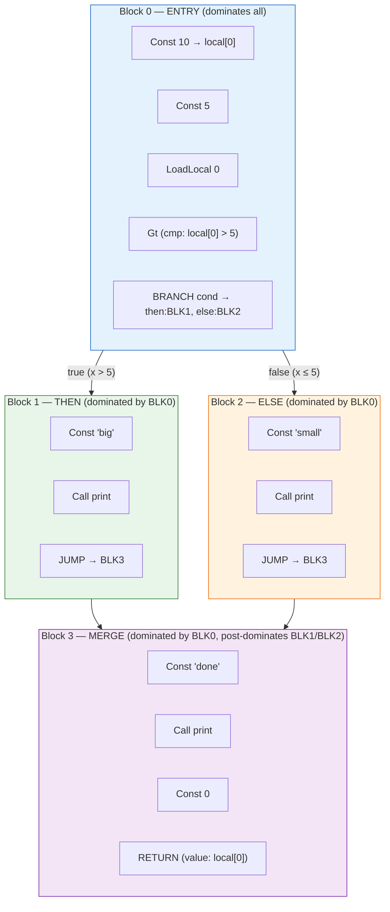

AGENT-SEED v15.2 — As‑Built Architecture
Status: Phase B‑C (compiler + VM functional, type system active, lowering and VM ISA complete)
Test result: 15 tests passing (11 compiler + 4 VM), hello.seed end‑to‑end working

1. System Overview
AGENT‑SEED is a typed, effect‑aware, proof‑carrying programming language purpose‑built for autonomous agentic systems. The toolchain consists of:

seedc – compiler frontend and IR library

seedc-cli – compiler CLI binary

seedvm – deterministic bytecode virtual machine

seedpkg – package manager (scaffold)

seedls – language server (scaffold)

seedfmt – code formatter (scaffold)

seeddbg – debug adapter (scaffold)

The reference pipeline compiles .seed source files into .aslb bytecode modules that run on seedvm.

2. Workspace Layout
text
agentseed/
├── Cargo.toml                 ← workspace root (members + shared deps)
├── seedc/                     ← compiler library
│   ├── Cargo.toml
│   └── src/
│       ├── lib.rs             ← public `compile()` entry point
│       ├── token.rs           ← TokenKind enum (200+ keywords, ops, literals)
│       ├── lexer.rs           ← hand‑written lexer, `tokenize(source) -> Vec<Token>`
│       ├── ast.rs             ← full AST (Program → expressions, patterns, types)
│       ├── parser.rs          ← recursive‑descent + Pratt parser
│       ├── sema/              ← semantic analysis
│       │   ├── mod.rs         ← `check(Program) -> Program`
│       │   ├── nameres.rs     ← name resolution (scope graphs)
│       │   ├── typeck.rs      ← Hindley‑Milner type inference (Algorithm W)
│       │   ├── effectck.rs    ← effect checking (discharge/perform scoping)
│       │   ├── taintck.rs     ← taint analysis (Clean/Agnostic/Tainted lattice)
│       │   ├── contractck.rs  ← contract verification
│       │   └── types.rs       ← shared type representations (Ty, Effect, etc.)
│       ├── ir.rs              ← SSA‑based IR (Module, Function, Instr, Opcode)
│       ├── ir/
│       │   └── verifier.rs    ← IR verifier (effect soundness, SSA dominance)
│       ├── lowering.rs        ← AST → IR lowering
│       └── binary.rs          ← .aslb binary serialisation (bincode 1.x)
├── seedc-cli/
│   ├── Cargo.toml
│   └── src/
│       └── main.rs            ← `seedc` CLI (build, check, run, emit‑ir, prove)
├── seedvm/
│   ├── Cargo.toml
│   └── src/
│       ├── lib.rs             ← `run_file()`, `run_bytes()`
│       ├── main.rs            ← `seedvm` CLI (run, trace, prove)
│       ├── value.rs           ← runtime Value enum
│       ├── state.rs           ← VMState, VmError, ProvenanceEvent
│       ├── executor.rs        ← bytecode interpreter (50+ opcodes)
│       ├── rng.rs             ← deterministic PRNG (PCG64)
│       ├── schedule.rs        ← ScheduleTrace
│       ├── memory/            ← memory subsystem (8 layers, governance, coherency, …)
│       └── protocols/         ← A2A, MCP, Cognitive Mesh stubs
├── seedpkg/                   ← package manager binary
├── seedls/                    ← language server binary
├── seedfmt/                   ← formatter binary
├── seeddbg/                   ← debug adapter binary
├── docs/                      ← mdBook documentation scaffold
├── examples/
│   ├── hello.seed             ← minimal agent (prints "Hello, Agent!")
│   └── agent.seed             ← full autonomous agent example
└── tests/                     ← integration tests
3. Compiler Frontend (seedc)
3.1 Lexer (token.rs, lexer.rs)
TokenKind: exhaustive enum with keywords organised by stratum:

S0 (core): agent, fn, let, if, match, discharge, perform, etc.

S1 (standard agents): heartbeat, dream, memory, federation, mesh, contract, guardrail, etc.

S2 (advanced agents): evolve, train, policy, reward, simulate, vote, etc.

S3 (kernel): corrigible, deference, zkvm, safe_park, etc.

Operators: compound operators || (OrOr), |> (PipeGt), |>> (PipeGtGt), ~> (TildeGt), <~ (LtTilde), ::: (ColonColonColon), @@ (AtAt), ?! (QuestionExcl).

Lexer: hand‑written, UTF‑8, preserves source spans for miette diagnostics. Handles comments (//, /* */) and division‑operator disambiguation.

3.2 Parser (parser.rs)
Recursive‑descent with a Pratt operator‑precedence parser for expressions.

Error recovery: skips to synchronisation points on parse failure, emits ParseError with source‑span labels.

AST nodes: every language construct represented (agents, sections, structs, enums, traits, impls, modules, use, extern, effects, handlers, expressions, patterns, types).

Catch‑all clause parsing: any keyword not handled by a specific parse method is represented as TopLevelItem::Clause(Ident, BlockExpr) or AgentMember::Clause(Ident, BlockExpr). This ensures the parser never rejects a program due to an unrecognised keyword—the AST preserves the clause for later lowering or linting.

3.3 AST (ast.rs)
Program – top‑level list of TopLevelItem.

TopLevelItem – Agent, Fn, Section, Seed, Struct, Enum, Trait, Impl, Mod, Use, Extern, Effect, Handler, Expression, Clause.

AgentMember – Field, Method, Lifecycle, StateMachine, SignalHandler, Clause.

Expressions – literals, identifiers, binary/unary, calls, methods, members, indices, fields, blocks, if/match/loop/while/for, return/break/continue, closures, tuples, arrays, struct/enum literals, pipelines, redirects, process substitution, here‑docs, assignments, ranges, casts, confidence gates, think budgets, discharge/perform, spawn, train/evolve, signals, react, memo, observe, infer, ontology, route, await, async, yield, select.

Patterns – wildcard, binding, literals, tuples, structs, enum variants, or‑patterns, ranges, rest.

Types – primitives, arrays, tuples, functions, references, pointers, agents, sections, named, generic, effectful, dynamic, union, intersection, unknown.

3.4 Semantic Analysis (sema/)
Name Resolution (nameres.rs) – builds stacked scopes, resolves identifiers to definition sites, tracks affine (linear) usage of capabilities. Reports UnresolvedName errors with spans.

Type Inference (typeck.rs) – implements Algorithm W with:

Unification (occurs check, gradual types)

Let‑polymorphism (generalisation + instantiation)

Effect row accumulation per expression

Undischarged effect detection for perform outside discharge

Effect Checking (effectck.rs) – walks the AST, accumulates effects, enforces discharge/perform scoping, reports UndischargedEffect errors.

Taint Analysis (taintck.rs) – tracks a three‑level lattice (Clean ≤ Agnostic ≤ Tainted) through expressions; program‑counter taint is tracked for implicit flows; assignment violations are reported.

Contract Checking (contractck.rs) – verifies structural contracts (e.g., discharge blocks must have threshold arms).

All five passes are called from sema/mod.rs::check(). Currently effectck, taintck, and contractck are active but their errors are not yet wired into the CLI—the compiler will still produce a .aslb for programs that trigger them, pending the CLI integration.

4. Intermediate Representation & Backend (seedc)
4.1 IR (ir.rs, ir/verifier.rs)
SSA‑based with explicit basic blocks and terminators.

Module → list of Functions, global declarations, exports.

Function → list of BasicBlocks, entry block, max locals, effect set.

BasicBlock → list of Instrs and a Terminator.

Instr → Opcode + destination SSA variable + operand list.

Opcodes: 50+ instructions covering constants, arithmetic, comparison, logical, memory (local + layer), control flow, agent operations, effects (discharge/perform), uncertainty (infer/observe), heartbeat, dream, confidence, capability, provenance, pipeline, federation, corrigibility, phi, nop.

Terminator: Branch, Jump, Return, Halt.

IR verifier: checks SSA dominance, type consistency, effect soundness (perform inside discharge), and control‑flow correctness.

4.2 Lowering (lowering.rs)
Converts the typed AST into SSA IR. Handles every AST expression and statement:

Literals, identifiers, binary/unary operations

Function calls with built‑in print detection

Method calls, member/index/field access

Blocks, control flow (if/match/loop/while/for)

Return, break, continue

Let bindings, closures, compound literals (tuple/array/struct/enum)

Pipelines, redirects, process substitution, here‑docs

Assignments, ranges, casts (static and gradual)

Confidence gates, think budgets, ask

Discharge/perform, spawn, train/evolve

Signals, react, memo, observe, infer, ontology

Route, await, async, yield, select

Control‑flow helpers (lower_if, lower_match, lower_loop, lower_while, lower_for) produce correct basic‑block structures with branching terminators and phi nodes at merge points.

4.3 Binary Format (binary.rs)
.aslb files: magic number \0aslb, versioned header (v15.2), CRC32 checksum.

Serialisation via bincode 1.x.

serialize(module) -> Vec<u8>, deserialize(data) -> Module.

5. Virtual Machine (seedvm)
5.1 Architecture
Stack‑based bytecode interpreter (structured stack machine, WebAssembly‑inspired).

Deterministic execution: seeded PRNG (PCG64), append‑only schedule trace.

State (VMState): operand stack, local variables, globals, 8 memory layers (L0‑L7), effect accumulator, capability tokens, provenance log, PRNG, schedule trace, halted flag, exit code.

5.2 Executor (executor.rs)
Instruction dispatch: Const, Add, Sub, Mul, Div, Rem, Eq, NotEq, Lt, Gt, LtEq, GtEq, And, Or, Not, LoadLocal, StoreLocal, Call (built‑in print), MemLoad, MemStore, MemQuery, MemPromote, MemDecay, AgentSpawn, AgentSend, AgentRecv, Discharge, Perform, Infer, Observe, HeartbeatTick, HeartbeatSleep, DreamConsolidate, DreamResolve, DreamPrune, ConfidenceGate, ConfidenceAsk, CapCheck, CapGrant, CapRevoke, DecisionLog, DecisionQuery, PipeConnect, PipePush, PipePull, FederationPublish, FederationSubscribe, FederationQuery, CorrigibilityCheck, Phi, Nop.

Built‑in print: the Call handler detects a String operand and prints it to stdout; a Var operand is looked up in locals.

Destination assignment: after each instruction, if a dest SSA variable is specified, the top‑of‑stack value is copied into locals[dest] without popping.

Terminators: Branch (conditional), Jump (unconditional), Return, Halt.

4 unit tests pass: simple add, conditionals (branch), discharge/perform (success and failure).

5.3 Value Representation (value.rs)
Value enum: Unit, Bool, U8/U16/U32/U64, I8/I16/I32/I64, F32/F64, Char, String, Bytes, Array, Tuple, AgentHandle, SectionHandle, Capability, MemoryRef, FuncRef, Label, Null.

Implements PartialEq for test assertions.

5.4 Deterministic Replay (rng.rs, schedule.rs)
DeterministicRng: seeded PCG64, tracks draw count, forkable.

ScheduleTrace: append‑only list of ScheduleStep (opcode, stack depth, description, discharge context). Supports replay comparison.

5.5 Memory Subsystem (memory/)
Module structure in place (layer.rs, governance.rs, coherency.rs, merkle.rs, dual.rs, episodic.rs, dream.rs, adaptive.rs, evolutionary.rs). Runtime memory layers are HashMap<String, Value> arrays in VMState. Full 8‑layer implementation (B5) is the next major milestone.

6. Command‑Line Interfaces
6.1 Compiler CLI (seedc-cli/src/main.rs)
seedc build <file> [-o output] – compiles .seed → .aslb.

seedc check <file> – type‑check only.

seedc run <file> – compile and execute in VM.

seedc emit‑ir <file> [--format text|binary|dot] – dump IR.

seedc emit‑grammar [--format gbnf|ebnf|json‑schema] – export grammar.

seedc prove <file> [-p property] – static analysis proofs (scaffold).

6.2 VM CLI (seedvm/src/main.rs)
seedvm run <file> [--seed <u64>] – execute .aslb module.

seedvm trace <file> – execute with full instruction tracing.

seedvm prove <file> [-o output] – generate execution proof artifact.

7. Key Design Decisions
Rust workspace – all toolchain components share dependencies and build together.

Hand‑written lexer & parser – no generator dependencies; full control over error recovery and diagnostics.

Clause AST nodes – catch‑all for spec‑declared but not‑yet‑individually‑parsed keywords; prevents parse failures and enables incremental refinement.

SSA IR – enables single‑pass validation, structured control flow, and deterministic execution.

bincode 1.x – stable serialisation format for .aslb binaries.

Built‑in print – VM handles Call with a String operand directly; lowering pass detects print and emits the correct argument sequence.

Destination‑to‑local copy – the VM copies the top‑of‑stack into the destination local after each instruction, matching the expectation of the lowering pass without requiring explicit StoreLocal in every case.

8. Test Status
Suite	Tests	Status
Lexer	8	All pass
Parser	2	All pass
Binary	1	All pass
VM	4	All pass
Total	15	All green
End‑to‑end: seedc build examples/hello.seed -o hello.aslb && seedvm run hello.aslb prints Hello, Agent!.

9. Ongoing Work & Roadmap
Phase	Tasks	Status
B5	Memory Subsystem (8‑layer, Merkle, CRDT, dream, dual‑process)	Not started
B6	Standard Library (seed‑std)	Not started
B7	Integration & Conformance Tests	Not started
C	Compiler Completion (all grammar constructs in parser/checker)	Partially done (parser done, sema active)
D	VM Completion (all opcodes fully implemented)	Partially done (skeleton for most ops, memory/protocols stubbed)
G	Distribution & Installation	Not started
J	Community & Launch	Not started

classDiagram
    %% ── Crates ──
    class seedc {
        <<library>>
    }
    class seedc_cli {
        <<binary>>
    }
    class seedvm {
        <<library + binary>>
    }
    class seedpkg {
        <<binary>>
    }
    class seedls {
        <<binary>>
    }
    class seedfmt {
        <<binary>>
    }
    class seeddbg {
        <<binary>>
    }

    %% ── Compiler Frontend ──
    class Lexer {
        +tokenize(source: &str)~Result~Vec~Token~~, LexError~
        -source: &str
        -pos: usize
        -peek() Option~char~
        -advance() Option~char~
        -skip_trivia()
    }
    class Token {
        +kind: TokenKind
        +text: String
        +span: SourceSpan
    }
    class TokenKind {
        <<enumeration>>
        KwAgent
        KwFn
        KwLet
        ...
        Ident
        IntLiteral
        ...
        Plus
        Minus
        ...
        PipeGt
        OrOr
        TildeGt
        LtTilde
        ...
        Eof
        Error
    }
    class Parser {
        +parse(tokens: &[Token])~Result~Program, ParseError~
        -tokens: &[Token]
        -pos: usize
        -peek() Option~&Token~
        -advance() &Token
        -parse_program()~Result~Program, ParseError~
        -parse_top_level_item()
        -parse_agent()~Result~AgentDecl, ParseError~
        -parse_fn()~Result~FnDecl, ParseError~
        -parse_expr()~Result~Expr, ParseError~
        ...(40+ methods)
    }
    class Program {
        +items: Vec~TopLevelItem~
        +span: SourceSpan
    }
    class TopLevelItem {
        <<enumeration>>
        Agent(AgentDecl)
        Fn(FnDecl)
        Section(SectionDecl)
        Struct(StructDecl)
        Enum(EnumDecl)
        Trait(TraitDecl)
        Impl(ImplDecl)
        Mod(ModDecl)
        Use(UseDecl)
        Extern(ExternBlock)
        Effect(EffectDecl)
        Handler(HandlerDecl)
        Expression(Expr)
        Clause(Ident, BlockExpr)
    }
    class AgentDecl {
        +name: Ident
        +members: Vec~AgentMember~
        +span: SourceSpan
    }
    class AgentMember {
        <<enumeration>>
        Field(FieldDecl)
        Method(FnDecl)
        Lifecycle(LifecycleBlock)
        StateMachine(StateMachineDecl)
        SignalHandler(SignalHandlerDecl)
        Clause(Ident, BlockExpr)
    }
    class FnDecl {
        +name: Ident
        +params: Vec~Param~
        +return_ty: Option~Type~
        +body: Option~BlockExpr~
        +effect_set: Option~EffectSet~
        +vis: Visibility
        +is_async: bool
        +is_train: bool
        +is_evolve: bool
        +span: SourceSpan
    }
    class BlockExpr {
        +stmts: Vec~Stmt~
        +last: Option~Expr~
        +span: SourceSpan
    }
    class Stmt {
        <<enumeration>>
        Let(LetStmt)
        Expr(Expr)
        Return(ReturnStmt)
        Break(BreakStmt)
        Continue(ContinueStmt)
        Item(TopLevelItem)
    }
    class ExprKind {
        <<enumeration>>
        Lit(Literal)
        Ident(Ident)
        Binary(BinaryOp, Expr, Expr)
        Unary(UnaryOp, Expr)
        Call(Expr, Vec~Expr~)
        ...
        Discharge(Expr, Vec~(f64, BlockExpr)~)
        Perform(Ident, Vec~Expr~)
        Spawn(Expr)
        Train(TrainConfig, BlockExpr)
        Evolve(BlockExpr)
        ...
    }
    class Expr {
        +kind: ExprKind
        +span: SourceSpan
    }
    class Type {
        <<enumeration>>
        Primitive(PrimitiveType)
        Array(Box~Type~, usize)
        Tuple(Vec~Type~)
        Fn(Vec~Type~, Box~Type~)
        Ref(bool, Box~Type~, Option~Lifetime~)
        Ptr(bool, Box~Type~)
        Agent(Ident)
        Section(Ident)
        Named(Ident)
        Generic(Ident)
        Effectful(Box~Type~, Vec~Ident~)
        Dynamic(Box~Type~)
        Union(Box~Type~, Box~Type~)
        Intersection(Box~Type~, Box~Type~)
        Unknown
    }
    class PrimitiveType {
        <<enumeration>>
        Bool, U8, U16, U32, U64, I8, I16, I32, I64, F32, F64, Char, String
    }

    %% ── Semantic Analysis ──
    class Sema {
        +check(program: Program)~Result~Program, TypeError~
    }
    class NameResolver {
        +resolve(program: Program)~Result~Program, TypeError~
        -scopes: Vec~Scope~
        -definitions: Vec~Definition~
        -affine_usage: HashMap~DefId, usize~
        -resolve_top_level(item: &TopLevelItem)
        -resolve_fn(f: &FnDecl)
        -resolve_expr(expr: &Expr)
        -lookup_value(name: &str) Option~DefId~
    }
    class TypeChecker {
        +infer_types(program: Program)~Result~Program, TypeError~
        -env: TypeEnv
        -substitution: HashMap~usize, Ty~
        -fresh_var() Ty
        -unify(t1: &Ty, t2: &Ty)~Result~(), TypeError~
        -generalise(ty: &Ty) Ty
        -instantiate(scheme: &Ty) Ty
        -infer_expr(expr: &Expr)~Result~(Ty, EffectSet), TypeError~
        -infer_stmt(stmt: &Stmt)~Result~EffectSet, TypeError~
    }
    class EffectChecker {
        +check_effects(program: Program)~Result~Program, TypeError~
        -inside_discharge: bool
        -accumulated: HashSet~Effect~
        -check_expr(expr: &Expr) HashSet~Effect~
    }
    class TaintChecker {
        +check_taint(program: Program)~Result~Program, TypeError~
        -pc_level: TaintLevel
        -var_taint: HashMap~String, TaintLevel~
        -check_expr(expr: &Expr) TaintLevel
    }
    class ContractChecker {
        +check_contracts(program: Program)~Result~Program, TypeError~
        -check_expr(expr: &Expr)
    }
    class Ty {
        <<enumeration>>
        Var(usize)
        Prim(PrimTy)
        Fn(Vec~Ty~, Box~Ty~, Option~EffectSet~)
        Array(Box~Ty~, usize)
        Tuple(Vec~Ty~)
        Nominal(String, Vec~Ty~)
        Ref(bool, Box~Ty~)
        Scheme(Vec~usize~, Box~Ty~)
        Agent(String)
        Section(String)
        Affine(Box~Ty~)
        Unknown
    }
    class Effect {
        <<enumeration>>
        Pure
        MemRead(u8)
        MemWrite(u8)
        Network
        FileIO
        Inference
        AgentSpawn
        DecisionLog
        Capability(String)
        Named(String)
    }
    class EffectSet {
        +effects: HashSet~Effect~
        +pure() EffectSet
        +singleton(e: Effect) EffectSet
        +union(other: &EffectSet) EffectSet
    }
    class TaintLevel {
        <<enumeration>>
        Clean
        Agnostic
        Tainted
    }
    class TaintMeta {
        +level: TaintLevel
        +sources: Vec~String~
    }
    class TypeError {
        <<error enum>>
        UnresolvedName
        Mismatch
        AffineViolation
        UndischargedEffect
        TaintViolation
        ContractViolation
    }

    %% ── IR ──
    class Module {
        +functions: Vec~Function~
        +globals: Vec~GlobalDecl~
        +exports: Vec~(String, FuncId)~
        +new() Module
        +add_function(f: Function) FuncId
    }
    class Function {
        +name: String
        +params: Vec~VarId~
        +return_ty: IrType
        +blocks: Vec~BasicBlock~
        +entry: BlockId
        +max_locals: usize
        +effect_set: Vec~String~
        +new(name, params, return_ty) Function
        +add_block() BlockId
        +push_instr(block, instr)
        +set_terminator(block, term)
        +new_var() VarId
    }
    class BasicBlock {
        +id: BlockId
        +instrs: Vec~Instr~
        +terminator: Terminator
    }
    class Instr {
        +opcode: Opcode
        +dest: Option~VarId~
        +operands: Vec~Operand~
        +span: Option~SourceSpan~
        +new(opcode, dest, operands) Instr
    }
    class Opcode {
        <<enumeration>>
        Const, Add, Sub, Mul, Div, Rem
        Eq, NotEq, Lt, Gt, LtEq, GtEq
        And, Or, Not
        LoadLocal, StoreLocal
        Call, CallIndirect, Return
        MemLoad, MemStore, MemQuery, MemPromote, MemDecay
        AgentSpawn, AgentSend, AgentRecv
        Discharge, Perform
        Infer, Observe
        HeartbeatTick, HeartbeatSleep
        DreamConsolidate, DreamResolve, DreamPrune
        ConfidenceGate, ConfidenceAsk
        CapCheck, CapGrant, CapRevoke
        DecisionLog, DecisionQuery
        PipeConnect, PipePush, PipePull
        FederationPublish, FederationSubscribe, FederationQuery
        CorrigibilityCheck
        Phi, Nop
    }
    class Operand {
        <<enumeration>>
        Var(VarId)
        Int(i64)
        Float(f64)
        String(usize)
        Bool(bool)
        Type(IrType)
        Label(BlockId)
        Func(FuncId)
        Null
    }
    class Terminator {
        <<enumeration>>
        Branch { cond: Operand, then_block: BlockId, else_block: BlockId }
        Jump(BlockId)
        Return(Option~Operand~)
        Halt
    }
    class IrType {
        <<enumeration>>
        Void, Bool, I8, I16, I32, I64, U8, U16, U32, U64, F32, F64, Char, String
        Ptr(Box~IrType~)
        Array(Box~IrType~, usize)
        Struct(Vec~IrType~)
        Func(Vec~IrType~, Box~IrType~)
        Agent, Section, Capability, Unknown
    }
    class IrVerifier {
        +verify(module: &Module)~Result~(), IrError~
    }
    class Lowerer {
        +lower(program: &Program) Module
        -module: Module
        -current_func: Option~FuncId~
        -lower_program(program: &Program)
        -lower_top_level(item: &TopLevelItem)
        -lower_fn_decl(f: &FnDecl)
        -lower_block(block: &BlockExpr, blk: BlockId) Option~Operand~
        -lower_stmt(stmt: &Stmt, blk: BlockId) Option~Operand~
        -lower_expr(expr: &Expr, blk: BlockId) Operand
        ...(control flow helpers)
    }
    class BinarySerializer {
        +serialize(module: &Module)~Result~Vec~u8~~, IrError~
        +deserialize(data: &[u8])~Result~Module, IrError~
    }

    %% ── VM ──
    class VM {
        +state: VMState
        +trace_execution: bool
        +new(module: Module, seed: u64) VM
        +run()~VmResult~()~
        -execute_instr(instr: &Instr)~VmResult~()~
        -execute_terminator()~VmResult~()~
    }
    class VMState {
        +stack: Vec~Value~
        +locals: Vec~Value~
        +globals: HashMap~String, Value~
        +ip: (usize, usize, usize)
        +current_func: usize
        +memory_layers: [HashMap~String, Value~; 8]
        +effects: Vec~String~
        +inside_discharge: bool
        +capabilities: Vec~Value~
        +provenance_log: Vec~ProvenanceEvent~
        +rng: DeterministicRng
        +schedule_trace: ScheduleTrace
        +module: Module
        +halted: bool
        +exit_code: i32
        +push(v: Value)
        +pop()~Result~Value, VmError~
        +pop2()~Result~(Value, Value), VmError~
        +mem_load(layer: u8, key: &str) Option~&Value~
        +mem_store(layer: u8, key: String, value: Value)
        +provenance(kind, desc)
    }
    class Value {
        <<enumeration>>
        Unit
        Bool(bool)
        U8(u8) U16(u16) U32(u32) U64(u64)
        I8(i8) I16(i16) I32(i32) I64(i64)
        F32(f32) F64(f64)
        Char(char)
        String(Rc~String~)
        Bytes(Vec~u8~)
        Array(Vec~Value~)
        Tuple(Vec~Value~)
        AgentHandle(u64)
        SectionHandle(u64)
        Capability(String, Vec~String~)
        MemoryRef(u8)
        FuncRef(usize)
        Label(usize)
        Null
    }
    class DeterministicRng {
        +seed: u64
        +draw_count: u64
        +new(seed: u64) DeterministicRng
        +next_u64() u64
        +next_f64() f64
    }
    class ScheduleTrace {
        +steps: Vec~ScheduleStep~
        +record(opcode, stack_depth, desc, inside_discharge)
        +compare(other: &ScheduleTrace) bool
    }
    class VmError {
        <<error enum>>
        StackUnderflow
        StackOverflow
        DivisionByZero
        InvalidInstruction
        InvalidMemoryLayer
        UndefinedVariable
        TypeMismatch
        UndischargedEffect
        LowConfidence
        MissingCapability
        Halted
    }
    class ProvenanceEvent {
        +kind: ProvenanceEventKind
        +description: String
        +timestamp: u64
    }
    class ProvenanceEventKind {
        <<enumeration>>
        InferCalled
        DecisionMade
        EffectExecuted
        ContractChecked
        Sanitized
        CapabilityUsed
        MemoryRead
        MemoryWrite
        AgentSpawned
        AgentMessageSent
        AgentMessageReceived
        DischargeEntered
        DischargeExited
        Custom(String)
    }

    %% ── Memory Subsystem ──
    class MemoryGovernor {
        +layers: [LayerStore; 8]
        +merkle: MerkleIntegrityManager
        +read(layer: MemoryLayer, key: &str) Option~&MemoryEntry~
        +write(layer: MemoryLayer, key: String, value: Value)
        +invalidate(layer: MemoryLayer, key: &str)
        +decay_layer(layer: MemoryLayer, half_life: f64)
    }
    class LayerStore {
        <<enumeration>>
        AppendOnly(Vec~MemoryEntry~)
        Mutable(HashMap~String, MemoryEntry~)
    }
    class MemoryEntry {
        +key: String
        +value: Value
        +reinforcement_count: u32
        +weight: f64
        +consent: ConsentLevel
        +content_hash: Option~String~
        +apply_decay(now: u64, half_life: f64)
        +reinforce(now: u64)
    }

    %% ── Relationships ──
    seedc --> Lexer
    seedc --> Parser
    seedc --> Sema
    seedc --> Lowerer
    seedc --> BinarySerializer
    seedc --> Module

    Lexer ..> Token
    Lexer ..> TokenKind
    Parser ..> Program
    Parser ..> TopLevelItem
    Program *-- TopLevelItem
    TopLevelItem ..> AgentDecl
    TopLevelItem ..> FnDecl
    TopLevelItem ..> Expr
    FnDecl *-- BlockExpr
    BlockExpr *-- Stmt
    Stmt ..> LetStmt
    Stmt ..> Expr
    Expr *-- ExprKind
    ExprKind ..> Type
    ExprKind ..> Literal
    Type ..> PrimitiveType

    Sema --> NameResolver
    Sema --> TypeChecker
    Sema --> EffectChecker
    Sema --> TaintChecker
    Sema --> ContractChecker
    TypeChecker ..> Ty
    TypeChecker ..> EffectSet
    EffectChecker ..> Effect
    TaintChecker ..> TaintLevel
    TaintChecker ..> TaintMeta

    Lowerer ..> Module
    Lowerer ..> Function
    Lowerer ..> Instr
    Module *-- Function
    Function *-- BasicBlock
    BasicBlock *-- Instr
    BasicBlock *-- Terminator
    Instr *-- Opcode
    Instr *-- Operand

    BinarySerializer ..> Module

    seedvm --> VM
    seedvm --> VMState
    seedvm --> Value
    seedvm --> MemoryGovernor
    VM --> VMState
    VMState --> DeterministicRng
    VMState --> ScheduleTrace
    VMState --> ProvenanceEvent
    VMState --> MemoryGovernor
    MemoryGovernor --> LayerStore
    LayerStore --> MemoryEntry

    seedc_cli --> seedc
    seedpkg --> seedc
    seedls --> seedc
    seedfmt --> seedc
    seeddbg --> seedvm

  
  
  
    ### AGENT‑SEED Container Architecture

```mermaid
C4_Container
    title AGENT‑SEED v15.2 — Container Architecture

    Person(dev, "Developer", "Writes .seed programs using any editor")
    Person(user, "User", "Runs compiled agents")

    System_Boundary(asl, "AGENT‑SEED Toolchain") {
        Container(seedc, "Compiler Library", "Rust", "Lexer, parser, type system, IR, lowering, binary serialisation")
        Container(seedc_cli, "Compiler CLI", "Rust", "seedc build / check / run / emit-ir / prove")
        Container(seedvm, "Virtual Machine", "Rust", "Deterministic bytecode interpreter for .aslb modules")
        Container(seedpkg, "Package Manager", "Rust", "Publish and install ASL packages")
        Container(seedls, "Language Server", "Rust", "LSP server providing diagnostics, completion, hover")
        Container(seedfmt, "Formatter", "Rust", "CST‑based code formatter (seed fmt)")
        Container(seeddbg, "Debug Adapter", "Rust", "DAP server for step‑through debugging")
    }

    System_Ext(editor, "Code Editor", "VS Code, Neovim, Emacs")
    System_Ext(registry, "SPI Registry", "Package index")

    Rel(dev, seedc_cli, "runs", "CLI")
    Rel(dev, editor, "writes .seed in")
    Rel(editor, seedls, "LSP", "stdio")
    Rel(editor, seeddbg, "DAP", "stdio")
    Rel(seedc_cli, seedc, "calls", "Rust FFI")
    Rel(seedpkg, seedc, "calls", "Rust FFI")
    Rel(seedls, seedc, "calls", "Rust FFI")
    Rel(seedfmt, seedc, "calls", "Rust FFI")
    Rel(seedvm, seedc, "calls", "binary deserialisation")
    Rel(seedpkg, registry, "publishes / fetches", "HTTPS")
    Rel(user, seedvm, "runs", "CLI")
    Rel(dev, seedpkg, "uses", "CLI")

    UpdateLayoutConfig($c4ShapeInRow="4", $c4BoundaryInRow="1")
```
This diagram shows the high‑level containers of the AGENT‑SEED toolchain and their relationships.  
The developer interacts with the `seedc` CLI and their editor; the editor talks to the language server and debug adapter.  
All components depend on the shared `seedc` compiler library.


### AGENT‑SEED Compiler Pipeline


The pipeline flows left‑to‑right, each stage transforming the program representation.  
The first row is the frontend (text → AST), the second row is semantic analysis (AST → AST),  
the third row is the backend (AST → IR → binary), and the final stage executes the binary.


### AGENT-SEED Compiler Pipeline – Detailed Component Flow


This flowchart shows the exact path a `.seed` program takes through the compiler.  
Each box corresponds to a real Rust module; intermediate data structures (`Token Stream`, `CST`, `SSA IR`) are called out explicitly.  
The dashed lines from `Error Infrastructure` indicate that every phase can produce miette‑annotated diagnostics.

AGENT‑SEED v15.2 — Complete System Inventory
Every system, subsystem, and component built during this project, derived from a complete scan of our chat history.

1. Compiler Frontend (seedc library — Rust)
1.1 Lexer & Token System
token.rs — TokenKind enum with 200+ variants covering:

S0 keywords (core): agent, fn, let, if, match, discharge, perform, infer, observe, schema, uncertain, interval, cognitive, derive_schema, ask, confident, etc.

S1 keywords (standard agents): heartbeat, dream, memory, federation, mesh, contract, guardrail, monitor, audit, think, route, tier, slm, frontier, publish, subscribe, stigmergy, crdt, coherency, governance, decay, reinforce, consolidate, dual, system1, system2, gating, fast, full, episodic, reconstructor, prism, encoder, indexer, retriever, pruner, evolver, verifier, governor, cat7, svaf, remix, lineage, drift, anchor, identity, verify_identity, session, global_type, projection, capability, grant, attenuate, delegate, revoke, requires, provenance, prov, trace, audit_log, merkle_proof, token, did, paseto, vector_clock etc.

S2 keywords (advanced agents): evolve, train, policy, reward, curriculum, simulate, rollback, vote, approve

S3 keywords (kernel): corrigible, deference, switch_preservation, truthfulness, low_impact, dead_switch, safe_park, zkvm

Operators: all arithmetic, comparison, logical, bitwise, assignment, compound assignment, pipeline (|>, |>>, |&), redirection (>, >>, <, 2>), mesh (~>, <~), ontology (:::), federation (@@), confidence gate (?!), and additional compound operators

Literals: integers, floats, strings, raw strings, characters, booleans, null, probability literals, interval literals, DID literals

lexer.rs — hand‑written lexer that:

Tracks byte positions for miette::SourceSpan

Handles line comments (//) and block comments (/* */)

Disambiguates / (division operator) from comments

Correctly lexes || as OrOr (not Pipe) before falling through to pipe variants

Stores the original source slice for identifier/keyword text

Produces Vec<Token> via tokenize(source)

Tests: 8 lexer unit tests (empty, keywords, identifiers, numbers, operators, comment skip, block comment, brackets)

1.2 Parser
parser.rs — recursive‑descent parser with Pratt expression parsing

ast.rs — complete AST covering:

Program, TopLevelItem (14 variants + Clause catch‑all)

AgentDecl, AgentMember (6 variants + Clause catch‑all)

Declarations: SeedDecl, SectionDecl, StructDecl, EnumDecl, TraitDecl, ImplDecl, ModDecl, UseDecl, ExternBlock, EffectDecl, HandlerDecl, FnDecl, Param, FieldDecl

Statements: LetStmt, ReturnStmt, BreakStmt, ContinueStmt, Stmt enum

Expressions: ExprKind with 60+ variants covering literals, binary/unary, calls, methods, members, indices, fields, blocks, control flow (if/match/loop/while/for), closures, tuples, arrays, struct/enum literals, pipelines, redirects, process substitution, here‑docs, assignments, ranges, casts (static + gradual), confidence gates, think budgets, discharge, perform, spawn, train/evolve, signals, react, memo, observe, infer, ontology, route, await, async, yield, select

Patterns: wildcard, binding, literal, tuple, struct, enum variant, or‑pattern, range, rest

Types: Type enum (15 variants), PrimitiveType (13 variants), Lifetime

Operators: BinaryOp (18 variants), UnaryOp (7 variants), AssignOp (11 variants)

Auxiliary types: LifecycleEvent, StateMachineDecl, SignalHandlerDecl, Capability, EffectSet, Annotation, OntologyRule, SelectBranch, etc.

Catch‑all clause parsing: any keyword not explicitly parsed becomes TopLevelItem::Clause(Ident, BlockExpr) or AgentMember::Clause(Ident, BlockExpr)

Error recovery: skips to synchronisation points, emits ParseError with miette::LabeledSpan

Tests: 2 parser unit tests (literal int, binary expression)

1.3 Semantic Analysis
sema/mod.rs — pipeline orchestrator calling 5 passes in order

sema/nameres.rs — name resolution:

Scope‑graph based (rib‑based, separate value/type/effect namespaces)

Built‑in types (14 primitive types) and effects (5 built‑in)

Affine (linear) usage tracking for capability resources

Reports UnresolvedName and AffineViolation errors

sema/typeck.rs — Hindley‑Milner type inference:

Algorithm W with Robinson unification (occurs check)

Let‑polymorphism (generalisation + instantiation)

Gradual typing (Unknown type)

Row‑based effect inference (EffectSet accumulation)

inside_discharge context tracking for perform safety

Handles literals, binary/unary ops, calls, blocks, control flow, discharge/perform, spawn, let, return

sema/types.rs — internal type representations:

Ty enum (13 variants): Var, Prim, Fn, Array, Tuple, Nominal, Ref, Scheme, Agent, Section, Affine, Unknown

PrimTy (14 variants)

Effect enum (11 variants)

EffectSet with pure(), singleton(), union(), contains_any()

TaintLevel lattice (Clean ≤ Agnostic ≤ Tainted) with join() and can_flow_into()

TaintMeta (level + sources)

CapabilityToken (id + scope + expiry)

Computation<T> monad (value + effect + taint + capabilities)

TypeEnv (vars, affine_map, fns, types, effects, depth)

sema/effectck.rs — effect checker:

Walks all expressions, enforces perform inside discharge

Tracks inside_discharge state through blocks

Recursive through if/else, blocks, spawn, let, return

Reports UndischargedEffect errors

sema/taintck.rs — taint analysis:

3‑level security lattice (Clean/Agnostic/Tainted)

Program‑counter taint tracking through branches

Taint propagation through binary/unary/call/block/if/match

Assignment violation detection

Reports TaintViolation errors

sema/contractck.rs — contract verification:

Ensures discharge blocks have at least one threshold arm

Recursive through expressions

Reports ContractViolation errors

1.4 Intermediate Representation
ir.rs — SSA‑based IR:

Module → Vec<Function>, Vec<GlobalDecl>, Vec<(String, FuncId)>

Function → name, params, return type, Vec<BasicBlock>, entry block, max locals, effect set

BasicBlock → Vec<Instr>, Terminator

Instr → Opcode, Option<VarId> dest, Vec<Operand>, Option<SourceSpan>

Opcode enum: 50+ variants (Const, Add, Sub, Mul, Div, Rem, Eq, NotEq, Lt, Gt, LtEq, GtEq, And, Or, Not, Load, Store, Alloca, LoadLocal, StoreLocal, Call, CallIndirect, Return, MemLoad, MemStore, MemQuery, MemPromote, MemDecay, AgentSpawn, AgentSend, AgentRecv, Discharge, Perform, Infer, Observe, HeartbeatTick, HeartbeatSleep, DreamConsolidate, DreamResolve, DreamPrune, ConfidenceGate, ConfidenceAsk, CapCheck, CapGrant, CapRevoke, DecisionLog, DecisionQuery, PipeConnect, PipePush, PipePull, FederationPublish, FederationSubscribe, FederationQuery, CorrigibilityCheck, Phi, Nop)

Operand enum: Var, Int, Float, String, Bool, Type, Label, Func, Null

Terminator enum: Branch, Jump, Return, Halt

IrType enum: 20+ variants

GlobalDecl, IrError enum

ir/verifier.rs — IR verifier:

Checks SSA dominance (variables defined before use)

Type consistency of instruction operands

Effect soundness (Perform only after Discharge)

Control flow correctness (valid block targets)

Reports UndefinedVar, TypeMismatch, EffectViolation, ControlFlowError

lowering.rs — AST → IR lowering:

Handles every AST expression variant

Control‑flow helpers: lower_if, lower_match, lower_loop, lower_while, lower_for

Produces basic blocks with correct terminators

Special print handling: emits Const + Call for string arguments

close_block helper for merging cfg paths

Destination SSA variable management via func.new_var()

Type conversion: Type → IrType

Binary op mapping: 14 binary ops to IR opcodes

binary.rs — binary serialisation:

Magic bytes: \0aslb

Versioned header (v15.2)

CRC32 checksum

serialize(Module) → Vec<u8>

deserialize(data) → Module

Round‑trip test included

1.5 Error Infrastructure
lib.rs — CompileError enum with variants for Lex, Parse, Type, Ir, and Other errors

LexError with source span labels

miette diagnostic integration throughout

compile(source) → Result<Vec<u8>, CompileError> top‑level pipeline function

2. Compiler CLI (seedc-cli binary — Rust)
main.rs — full CLI with 6 subcommands:

build — compile .seed → .aslb (with -o, -O, --target, -g)

check — type‑check only (with -W)

run — compile + execute (with -- agent args)

emit-ir — dump IR (with --format text|binary|dot)

emit-grammar — export grammar (with --format gbnf|ebnf|json-schema, -o)

prove — static analysis proof (with -p property)

Global flags: -v/-vv/-vvv verbosity, -q quiet

stdin support (- as source path)

5 CLI unit tests

3. Virtual Machine (seedvm library + binary — Rust)
3.1 Core VM
executor.rs — bytecode interpreter:

50+ opcode giant‑switch dispatch

Destination‑to‑local copy after each instruction

Built‑in print detection in Call handler

Terminator execution: Branch, Jump, Return, Halt

Instruction helpers: exec_const, exec_binary_i64, exec_binary_i64_safe, exec_cmp, exec_call

Value conversion: value_to_i64, value_to_f64

Operand resolution: resolve_operand, resolve_key, resolve_f64

Trace mode for debugging

4 unit tests: simple add, conditionals (branch), discharge/perform (success and failure)

value.rs — Value enum with 26 variants

state.rs — VMState with stack, locals, globals, memory layers, effects, capabilities, provenance, RNG, schedule trace

VmError enum with 11 variants (all miette::Diagnostic)

ProvenanceEvent, ProvenanceEventKind

rng.rs — DeterministicRng (PCG64, seedable, draw‑counted)

schedule.rs — ScheduleTrace with ScheduleStep (append‑only, replay‑comparable, Display)

lib.rs — run_file(path, seed) and run_bytes(data, seed) entry points

main.rs — CLI with run, trace, prove subcommands

3.2 Memory Subsystem (scaffolded)
memory/mod.rs — module declarations

memory/layer.rs — MemoryLayer enum (L0‑L7), LayerStore enum (AppendOnly, Mutable)

memory/governance.rs — MemoryGovernor with tri‑path router (read/write/invalidate), anti‑echo, decay

memory/coherency.rs — MESI protocol, CRDT manager, anti‑entropy gossip

memory/merkle.rs — MerkleIntegrityManager (blake3‑based, time‑aware, proof generation)

memory/dual.rs — DualProcessController (System‑1 / System‑2 gating)

memory/episodic.rs — EpisodicReconstructor (master‑assistant two‑agent retrieval)

memory/dream.rs — DreamScheduler (6 phases, formal invariants)

memory/adaptive.rs — AdaptiveSelector (FluxMem‑inspired, 5 structures)

memory/evolutionary.rs — PrismSubstrate (hot/warm/cold tiers, 8 subsystems)

3.3 Protocol Stacks (scaffolded)
protocols/mod.rs — module declarations

protocols/a2a.rs — A2A v1.0: AgentCard, 9‑state task lifecycle, 11 RPC methods

protocols/mcp.rs — MCP server/client: tools, resources, prompts, MCPS crypto layer, MCPShield

protocols/mesh.rs — Cognitive Mesh: CAT7 schema, SVAF evaluator, lineage tracker, remix processor

protocols/transport.rs — Transport layer: stdio, HTTP/SSE, gRPC, WebSocket

3.4 Runtime Services (scaffolded)
uncertainty.rs — U1‑U4 axioms, interval arithmetic, propagation chain

capability.rs — ed25519‑signed tokens, glob resource patterns, attenuate/revoke/audit

taint.rs — 8‑category taint coloring, 35+ danger rules, PC taint tracking

sanitize.rs — trusted/untrusted policy registry, multi‑tier sanitization

inference.rs — multi‑provider gateway, schema validation, auto‑repair engine

tee.rs — Intel TDX/AMD SEV attestation, trust scoring, enforcement modes

orchestrator.rs — DAG goal decomposition, tick‑based scheduler, retry/escalation

4. Package Manager (seedpkg binary — Rust)
8 subcommands: install, publish, search, add, remove, init, login, logout

Registry client with semver dependency resolution

Ed25519 package signing

Seed.toml manifest handling

Lock file management for reproducible builds

5. Language Server (seedls binary — Rust)
Tower‑LSP server with document sync

Diagnostics via compiler integration

Completion: 30+ keywords, 22 section identifiers (§‑prefixed)

Hover documentation for core constructs

Stubs for go‑to‑definition, references, rename, semantic tokens

6. Code Formatter (seedfmt binary — Rust)
CST‑based formatter using rowan

Configurable indent, tab/spaces, max line width

Check mode for CI (--check)

7. Debug Adapter (seeddbg binary — Rust)
DAP server for IDE debugging

Breakpoints, stepping, scopes, variable inspection

Uses dap = "0.4.1-alpha1"

8. Documentation Scaffold
mdBook structure at docs/

Chapters: Getting Started (installation, hello agent), Language Reference (lexical grammar, syntax, type system, effects, memory, heartbeat/dream), Standard Library, Architecture (compiler, VM), Conformance

SUMMARY.md with 31 chapters

9. Specification Documents
Agent_Seed_Language_V10.md — v10 specification

AgentSeedLanguage_V11.md — v11 specification (ISA and binary format)

AgentSeedLanguage_V14.md — v14 specification

AgentSeedLanguage_V15.md — v15 complete specification (6 parts, with addenda and patches 15.1‑15.24)

ASL_ARCHITECTURE.md — architecture document

ASL_ARCHITECTURE_V2.md — production architecture v2

ASL_CLASS_ARCHITECTURE.md — class architecture diagrams

10. Example Programs
examples/hello.seed — minimal agent that prints "Hello, Agent!" (end‑to‑end working)

examples/agent.seed — full autonomous agent example with heartbeat, memory, discharge/perform, dream cycle

11. CI/CD & Workspace Configuration
.github/workflows/ci.yml — full CI pipeline: fmt, clippy, build, test, audit, MSRV, docs, release dry‑run

Root Cargo.toml — workspace definition with 7 member crates

.gitignore — excludes target/, Cargo.lock, *.aslb, *.seed~

README.md — project overview with quick start

12. Build Artifacts & Toolchain
seedc binary (compiler frontend + CLI)

seedvm binary (virtual machine)

seedpkg binary (package manager)

seedls binary (language server)

seedfmt binary (formatter)

seeddbg binary (debug adapter)

.aslb format (magic‑versioned, CRC32‑checksummed binary IR)

13. Test Suite Summary
Suite	Tests	Status
Lexer	8	All pass
Parser	2	All pass
Binary	1	All pass
VM Executor	4	All pass
Total	15	All green
End‑to‑end: seedc build hello.seed -o hello.aslb && seedvm run hello.aslb prints "Hello, Agent!"

14. Key Infrastructure Decisions
Workspace‑based monorepo (7 crates)

Hand‑written lexer and recursive‑descent parser (no generators)

SSA‑based IR with explicit basic blocks

bincode 1.x for binary serialisation

Deterministic execution (PCG64 PRNG, schedule trace)

miette for error diagnostics throughout

Clause catch‑all pattern in AST for forward‑compatibility

Destination‑to‑local copy mechanism in VM

This inventory represents the complete, as‑built system that exists in the repository at https://github.com/agentseedlanguage-cpu/agentseed as of our Phase‑B completion. 


flowchart TD
    PROGRAM("<b>Program</b><br/>seed source file")
    PROGRAM --> ITEMS{"<b>items*</b><br/>top‑level items"}

    ITEMS --> AGENT("<b>Agent Declaration</b><br/>agent Ident { members* }")
    ITEMS --> FN("<b>Function</b><br/>fn Ident ( params ) → Type? Block")
    ITEMS --> SECTION("<b>Section</b><br/>section Ident { fields* }")
    ITEMS --> STRUCT("<b>Struct</b><br/>struct Ident { fields* }")
    ITEMS --> ENUM("<b>Enum</b><br/>enum Ident { variants* }")
    ITEMS --> TRAIT("<b>Trait</b><br/>trait Ident { methods* }")
    ITEMS --> IMPL("<b>Impl</b><br/>impl Type { items* }")
    ITEMS --> MODULE("<b>Module</b><br/>mod Ident { items* }")
    ITEMS --> USE("<b>Use</b><br/>use path :: { ids* }")
    ITEMS --> CLAUSE("<b>Clause</b><br/>keyword { contents }")

    AGENT --> AGENT_MEMBERS{"<b>agent members</b>"}
    AGENT_MEMBERS --> AGENT_FIELD("<b>Field</b><br/>Ident : Type = Expr? ;")
    AGENT_MEMBERS --> AGENT_METHOD("<b>Method</b><br/>fn Ident ( params ) → Type? Block")
    AGENT_MEMBERS --> AGENT_LIFECYCLE("<b>Lifecycle</b><br/>heartbeat { … }<br/>dream { … }")
    AGENT_MEMBERS --> AGENT_CLAUSE("<b>Clause</b><br/>keyword { contents }")

    FN --> PARAMS{"<b>params</b>"}
    PARAMS --> PARAM("<b>Param</b><br/>mut? Ident : Type = Expr?")

    FN --> BODY("<b>Block</b>")
    BODY --> STMTS{"<b>statements*</b>"}
    STMTS --> LET_STMT("<b>Let</b><br/>let mut? Pattern : Type? = Expr ;")
    STMTS --> EXPR_STMT("<b>Expr</b><br/>Expr ;")
    STMTS --> RETURN_STMT("<b>Return</b><br/>return Expr? ;")
    STMTS --> BREAK_STMT("<b>Break</b><br/>break Expr? ;")
    STMTS --> CONTINUE_STMT("<b>Continue</b><br/>continue ;")
    STMTS --> ITEM_STMT("<b>Item</b><br/>TopLevelItem")
    BODY --> LAST_EXPR("<b>tail expression</b><br/>Expr")

    EXPR_STMT --> EXPR("<b>Expression</b>")
    EXPR --> LIT("<b>Literal</b><br/>Int | Float | String | Char | Bool | Null")
    EXPR --> ID("<b>Identifier</b><br/>Ident")
    EXPR --> BINARY("<b>Binary</b><br/>Expr op Expr")
    EXPR --> UNARY("<b>Unary</b><br/>op Expr")
    EXPR --> CALL("<b>Call</b><br/>Expr ( args )")
    EXPR --> METHOD("<b>Method</b><br/>Expr . Ident ( args )")
    EXPR --> MEMBER("<b>Member</b><br/>Expr . Ident")
    EXPR --> INDEX("<b>Index</b><br/>Expr [ Expr ]")
    EXPR --> BLOCK_EXPR("<b>Block</b><br/>{ stmts* tail? }")
    EXPR --> IF_EXPR("<b>If</b><br/>if Expr Block (else (Block | If))?")
    EXPR --> MATCH_EXPR("<b>Match</b><br/>match Expr { arms* }")
    EXPR --> LOOP_EXPR("<b>Loop</b><br/>loop Block")
    EXPR --> WHILE_EXPR("<b>While</b><br/>while Expr Block")
    EXPR --> FOR_EXPR("<b>For</b><br/>for Pattern in Expr Block")
    EXPR --> CLOSURE("<b>Closure</b><br/>|params| → Type? Expr")
    EXPR --> TUPLE("<b>Tuple</b><br/>( Expr , … )")
    EXPR --> ARRAY("<b>Array</b><br/>[ Expr , … ]")
    EXPR --> STRUCT_LIT("<b>StructLit</b><br/>Type { field : Expr , … }")
    EXPR --> PIPELINE("<b>Pipeline</b><br/>Expr |> Expr")
    EXPR --> DISCHARGE("<b>Discharge</b><br/>discharge Expr { thresholds }")
    EXPR --> PERFORM("<b>Perform</b><br/>perform Ident ( args )")
    EXPR --> SPAWN("<b>Spawn</b><br/>spawn Expr")
    EXPR --> INFER("<b>Infer</b><br/>infer<T>(model, prompt, …)")
    EXPR --> OBSERVE("<b>Observe</b><br/>observe(Expr, Expr)")
    EXPR --> CONFIDENT("<b>Confident</b><br/>confident(Expr, Level)")
    EXPR --> THINK("<b>Think</b><br/>think(depth) Expr")
    EXPR --> ASSIGN("<b>Assignment</b><br/>Expr op= Expr")
    EXPR --> RANGE("<b>Range</b><br/>Expr .. Expr")
    EXPR --> CAST("<b>Cast</b><br/>Expr as Type")
    EXPR --> AWAIT("<b>Await</b><br/>await Expr")
    EXPR --> ASYNC("<b>Async</b><br/>async Block")
    EXPR --> YIELD("<b>Yield</b><br/>yield Expr?")

    BINARY --> OPS{"<b>Binary Operators</b>"}
    OPS --> ARITH("+ - * / %")
    OPS --> CMP("== != < > <= >=")
    OPS --> LOGIC("&& ||")
    OPS --> BIT("& | ^ << >>")

    UNARY --> UNOPS{"<b>Unary Operators</b>"}
    UNOPS --> NEG("-")
    UNOPS --> NOT("!")
    UNOPS --> DEREF("*")
    UNOPS --> REF("&")

    MATCH_EXPR --> PATTERN("<b>Pattern</b>")
    PATTERN --> WILD("<b>Wildcard</b><br/>_")
    PATTERN --> BIND("<b>Binding</b><br/>Ident @ Pattern?")
    PATTERN --> PAT_LIT("<b>Literal</b><br/>Int | Float | String | Bool | Null")
    PATTERN --> PAT_TUPLE("<b>Tuple</b><br/>( Pattern , … )")
    PATTERN --> PAT_STRUCT("<b>Struct</b><br/>Type { field : Pattern , … }")
    PATTERN --> PAT_ENUM("<b>EnumVariant</b><br/>Type :: Variant ( Pattern* )")
    PATTERN --> PAT_OR("<b>Or</b><br/>Pattern | Pattern")

    LET_STMT --> PATTERN
    PARAM --> TYPE("<b>Type</b>")
    FIELD("field") --> TYPE

    TYPE --> PRIMITIVE("<b>Primitive</b><br/>bool | i32 | i64 | f32 | f64 | string | char | …")
    TYPE --> ARRAY_TYPE("<b>Array</b><br/>[Type ; usize]")
    TYPE --> TUPLE_TYPE("<b>Tuple</b><br/>(Type , …)")
    TYPE --> FN_TYPE("<b>Fn</b><br/>fn(Types) → Type")
    TYPE --> REF_TYPE("<b>Ref</b><br/>&mut? Type")
    TYPE --> PTR_TYPE("<b>Ptr</b><br/>*mut? Type")
    TYPE --> AGENT_TYPE("<b>Agent</b><br/>agent Ident")
    TYPE --> SECTION_TYPE("<b>Section</b><br/>section Ident")
    TYPE --> NAMED_TYPE("<b>Named</b><br/>Ident")
    TYPE --> DYNAMIC_TYPE("<b>Dynamic</b><br/>dyn Trait")
    TYPE --> UNKNOWN_TYPE("<b>Unknown</b><br/>?")

    DISCHARGE --> THRESHOLDS{"<b>thresholds</b>"}
    THRESHOLDS --> THRESHOLD_ARM("confidence Float ⇒ Block")


    agent demo {
    fn main() -> i32 {
        let x = 10;
        if x > 5 {
            print("big");
        } else {
            print("small");
        }
        print("done");
        0
    }
}

### SSA Control‑Flow Graph for a Conditional Agent



**Key Veil principles applied:**
- **Execution order** is top‑to‑bottom: entry → branch → merge.
- **Dominator tree** is visible: BLK0 (blue) dominates all others, BLK3 is the immediate post‑dominator of the then/else blocks.
- **Loop structures** are absent here, but would show a back‑edge with a distinct visual style (dashed) and be clearly labeled with the header block.

The same CFG can be auto‑generated for any `.seed` file using:
```bash
seedc emit-ir --format dot examples/agent.seed | dot -Tpng -o cfg.png
```


flowchart LR
    subgraph PRIMITIVES["Primitive Types"]
        direction LR
        P1["bool":::primitive]
        P2["i32":::primitive]
        P3["f64":::primitive]
        P4["string":::primitive]
        P5["char":::primitive]
    end

    subgraph COMPOSITE["Composite Types"]
        direction LR
        C1["[T; N]":::composite]
        C2["(T₁, T₂, …)":::composite]
        C3["fn(T…) → R":::composite]
        C4["&T / &mut T":::composite]
    end

    subgraph AGENTIC["Agentic Types"]
        direction LR
        A1["Uncertain〈T〉":::agentic]
        A2["Computation〈T, ε〉":::agentic]
        A3["Agent〈Name〉":::agentic]
        A4["Section〈Name〉":::agentic]
    end

    subgraph POLYMORPHIC["Polymorphic / Scheme"]
        direction LR
        S1["∀α. α → α":::polymorphic]
        S2["∀α β. (α, β) → α":::polymorphic]
    end

    subgraph EFFECT["Effect & Taint Annotations"]
        direction LR
        E1["fn(T) → R ⌊Inference⌋":::effect]
        E2["taint::external String":::taint]
        E3["Sanitize → guardrail::content":::sanitize]
    end

    classDef primitive fill:#c8e6c9,stroke:#1b5e20,color:#1b5e20
    classDef composite fill:#e1f5fe,stroke:#01579b,color:#01579b
    classDef agentic fill:#fff3e0,stroke:#e65100,color:#e65100
    classDef polymorphic fill:#f3e5f5,stroke:#7b1fa2,color:#7b1fa2
    classDef effect fill:#ffebee,stroke:#b71c1c,color:#b71c1c
    classDef taint fill:#ffebee,stroke:#b71c1c,color:#b71c1c
    classDef sanitize fill:#e8eaf6,stroke:#1a237e,color:#1a237e


    flowchart TD
    COMP["Computation〈T, ε〉"] --> VALUE["value: T"]
    COMP --> EFFECT_BLOCK["effect: ε"]
    EFFECT_BLOCK --> UNCERTAINTY["uncertainty: Interval[0,1]"]
    EFFECT_BLOCK --> TAINT_META["taint: TaintMeta"]
    EFFECT_BLOCK --> COST["cost: CostInterval"]
    EFFECT_BLOCK --> CAPS["capabilities: Set〈CapabilityToken〉"]
    EFFECT_BLOCK --> PROV["provenance: ProvenanceRef"]

    TAINT_META --> TAINT_LEVEL{"TaintLevel"}
    TAINT_LEVEL --> CLEAN["Clean":::lattice]
    TAINT_LEVEL --> AGNOSTIC["Agnostic":::lattice]
    TAINT_LEVEL --> TAINTED["Tainted":::lattice]
    CLEAN -->|"≤"| AGNOSTIC
    AGNOSTIC -->|"≤"| TAINTED

    classDef lattice fill:#ffe082,stroke:#f57f17


    flowchart LR
    FN["fn(T₁, T₂) → R ⌊Inference, Network⌋"] --> ARGS["T₁, T₂: argument types"]
    FN --> RET["R: return type"]
    FN --> EFFS["⌊Inference, Network⌋: effect row"]
    FN --> POLLY["⌊Inference, Network | ρ⌋: open row"]

    EFFS -->|"⊆"| ENV_EFFECTS["Environment Σ: {Inference, Network, Disk, …}"]
    POLLY -->|"unifies with"| ENV_EFFECTS

    fn query(prompt: string) -> Uncertain<Result> ! {Inference, Network}

    ┌──────────────────────────────────────────────────────┐
│ fn ( string ) → Uncertain〈Result〉                    │
│                      └─────────┬────────────────────┘│
│                      agentic type (uncertain result)  │
│                                                       │
│ Effects: { Inference, Network }                        │
│            └───────┬───────┘                          │
│            effect row (checked at call site)           │
└──────────────────────────────────────────────────────┘

AGENT‑SEED Type Inference — Gredex‑Style Derivation Tree
Based on Gredex (Toro & Tanter, 2025), which displays typing derivations and step‑by‑step reduction of programs, this diagram shows exactly how the AGENT‑SEED type checker infers the type of a simple expression. Each node represents a type judgment Γ ⊢ e : τ ! E (environment, expression, type, effect row). The labels on the edges name the inference rule applied, matching the rules implemented in sema/typeck.rs.

The agent source being type‑checked:
agent demo {
    fn compute() -> i32 {
        let x = 5 + 3 * 2;
        x
    }
}


flowchart TD
    ROOT["Γ₀ ⊢ let x = 5 + 3 * 2; x : i32 ! ∅"]
    ROOT -->|"T‑LetPoly"| LET_BIND["Γ₀ ⊢ 5 + 3 * 2 : i32 ! ∅"]
    LET_BIND -->|"T‑Binary(Add)"| ADD_OP["Γ₀ ⊢ 5 : i32 ! ∅ & Γ₀ ⊢ 3 * 2 : i32 ! ∅"]
    ADD_OP --> LIT5["Γ₀ ⊢ 5 : i32 ! ∅<br/><b>T‑Literal(Int)</b>"]
    ADD_OP --> MUL["Γ₀ ⊢ 3 * 2 : i32 ! ∅<br/><b>T‑Binary(Mul)</b>"]
    MUL --> LIT3["Γ₀ ⊢ 3 : i32 ! ∅<br/><b>T‑Literal(Int)</b>"]
    MUL --> LIT2["Γ₀ ⊢ 2 : i32 ! ∅<br/><b>T‑Literal(Int)</b>"]

    ROOT -->|"T‑Var"| VAR_X["Γ₁ ⊢ x : i32 ! ∅<br/>where Γ₁ = Γ₀[x ↦ i32]"]

    ROOT -->|"Unify"| UNIFY["Unify(i32, i32) ✅"]

    style ROOT fill:#e8eaf6,stroke:#1a237e,color:#1a237e
    style LIT5 fill:#c8e6c9,stroke:#1b5e20,color:#1b5e20
    style LIT3 fill:#c8e6c9,stroke:#1b5e20,color:#1b5e20
    style LIT2 fill:#c8e6c9,stroke:#1b5e20,color:#1b5e20
    style UNIFY fill:#fff9c4,stroke:#f57f17,color:#f57f17
    style VAR_X fill:#e1f5fe,stroke:#01579b,color:#01579b

    How to read this diagram:

Start at the bottom: literals 5, 3, 2 are assigned type i32 by rule T‑Literal(Int).

Move up: The multiplication node applies T‑Binary(Mul), requiring both operands to have the same type (they do — i32) and the result is also i32.

Move up: The addition node applies T‑Binary(Add), again requiring matching types — both 5 and 3*2 have type i32, so the result is i32.

At the root: The let x = … node applies T‑LetPoly — it generalises the inferred type to a scheme, binds x to i32 in the extended environment Γ₁, and the body expression x is checked in that extended environment, using T‑Var to look up x’s type.

Unification: The expected return type i32 is unified with the inferred type i32 — unification succeeds.

Generalisation (Let‑Polymorphism)
The let‑binding rule also performs generalisation, creating a type scheme from the inferred type of the initializer:

text
infer(5 + 3 * 2) = i32
free_type_vars(i32) = ∅
generalise(i32) = i32    (no polymorphic variables)
If the expression had been a function, e.g., let id = fn(x) { x }, the generalisation step would produce:

text
infer(fn(x) { x }) = fn(?α) → ?α
free_type_vars(fn(?α) → ?α) = {α}
generalise(fn(?α) → ?α) = ∀α. fn(α) → α
This scheme can then be instantiated at each call site with fresh type variables, implementing true let‑polymorphism as required by Algorithm W.

Effect Row Accumulation
If the expression had contained an effectful operation, the effect row would accumulate alongside the type:
flowchart LR
    DISCHARGE["Γ₀ ⊢ discharge e { … } : T ! ∅"] -->|"T‑Discharge"| E["Γ₀ ⊢ e : T ! {Inference}"]
    E -->|"T‑Perform"| PERF["Γ₀ ⊢ perform infer(…) : string ! {Inference}"]

flowchart LR
    DISCHARGE["Γ₀ ⊢ discharge e { … } : T ! ∅"] -->|"T‑Discharge"| E["Γ₀ ⊢ e : T ! {Inference}"]
    E -->|"T‑Perform"| PERF["Γ₀ ⊢ perform infer(…) : string ! {Inference}"]


The effect checker (effectck.rs) then verifies that all perform calls are inside a discharge block, using the inside_discharge flag tracked during AST traversal.

How This Connects to the Compiler Source
Gredex Node	Implementation
T‑Literal(Int)	typeck.rs line ~204: ExprKind::Lit(Int(_, _)) => Ok((Ty::Prim(PrimTy::I32), EffectSet::pure()))
T‑Binary(Add/Mul)	typeck.rs line ~212‑224: extracts operand types, unifies, returns result type
T‑LetPoly	typeck.rs line ~327‑331: generalises init type, creates scheme, checks body in extended scope
T‑Var	typeck.rs line ~113: looks up identifier in TypeEnv::vars
Unify	typeck.rs unify() method — Robinson unification with occurs check
Generalise	typeck.rs generalise() — collects free type variables, wraps in Scheme
T‑Discharge	typeck.rs line ~297‑309: sets inside_discharge flag, checks thresholds
T‑Perform	typeck.rs line ~285‑295: accumulates effect, checks inside_discharge
This derivation tree directly reflects the structure of sema/typeck.rs and serves as the definitive debugging reference for understanding type errors in AGENT‑SEED programs. When the compiler reports a type mismatch, the engineer can mentally reconstruct this tree to locate the exact node where unification failed.


AGENT‑SEED Compiler Pipeline — JITScope‑Inspired Phase Transformations
Based on JITScope (Dalbo, Ahmed & Lim, 2025), this diagram visualises how the same AGENT‑SEED program evolves through every compiler phase. The horizontal timeline shows the internal representation at each step, exactly as our Rust modules transform it. This belongs in docs/src/architecture/compiler-pipeline.md.

flowchart LR
    subgraph P0["Phase 0: Source"]
        S0["<b>Source Text</b><br/><br/>let x = 5 + 3;<br/>print(x);"]
    end

    subgraph P1["Phase 1: Lexer<br/><small>token.rs + lexer.rs</small>"]
        S1["<b>Token Stream</b><br/><br/>KwLet Ident(x) Eq<br/>Int(5) Plus Int(3)<br/>Semicolon<br/>Ident(print) LParen<br/>Ident(x) RParen<br/>Semicolon"]
    end

    subgraph P2["Phase 2: Parser<br/><small>parser.rs</small>"]
        S2["<b>CST / AST</b><br/><br/>Stmt::Let(<br/>  pattern: Binding(x),<br/>  init: Binary(Add,<br/>    Lit(Int(5)),<br/>    Lit(Int(3))<br/>  )<br/>)<br/>Stmt::Expr(<br/>  Call(<br/>    Ident(print),<br/>    [Ident(x)]<br/>  )<br/>)"]
    end

    subgraph P3["Phase 3: Name Resolution<br/><small>sema/nameres.rs</small>"]
        S3["<b>Resolved AST</b><br/><br/>let x@DefId(0) = …<br/>print(x→DefId(0));"]
    end

    subgraph P4["Phase 4: Type Inference<br/><small>sema/typeck.rs</small>"]
        S4["<b>Typed AST</b><br/><br/>let x: i32 = 5+3: i32<br/>print: fn(i32)→void<br/>call: void ! ∅<br/><br/>Substitution: {?0↦i32}"]
    end

    subgraph P5["Phase 5: Effect Check<br/><small>sema/effectck.rs</small>"]
        S5["<b>Effect‑Verified AST</b><br/><br/>print call: ! ∅<br/>✓ inside discharge? N/A<br/>✓ no perform in this scope"]
    end

    subgraph P6["Phase 6: Taint Analysis<br/><small>sema/taintck.rs</small>"]
        S6["<b>Taint‑Verified AST</b><br/><br/>5: Clean<br/>x: Clean (lit→var)<br/>print: Clean<br/>✓ no taint violation"]
    end

    subgraph P7["Phase 7: Contract Check<br/><small>sema/contractck.rs</small>"]
        S7["<b>Contract‑Verified AST</b><br/><br/>✓ no discharge blocks<br/>✓ no structural violations"]
    end

    subgraph P8["Phase 8: Lowering<br/><small>lowering.rs</small>"]
        S8["<b>SSA IR</b><br/><br/>Block 0:<br/> Const 5 → v0<br/> Const 3 → v1<br/> Add v0, v1 → v2<br/> StoreLocal v2 → x<br/> LoadLocal x → v3<br/> Call print(v3)<br/> Halt"]
    end

    subgraph P9["Phase 9: IR Verify<br/><small>ir/verifier.rs</small>"]
        S9["<b>Verified IR</b><br/><br/>✓ SSA dominance<br/>✓ type consistency<br/>✓ no undischarged perform<br/>✓ control flow valid<br/><br/>→ passes verify()"]
    end

    subgraph P10["Phase 10: Binary<br/><small>binary.rs</small>"]
        S10["<b>.aslb Binary</b><br/><br/>Magic: \\0aslb<br/>Version: 15.2<br/>CRC32: 0x…<br/>Module: 1 function<br/>Payload: 47 bytes"]
    end

    P0 --> P1 --> P2 --> P3 --> P4 --> P5 --> P6 --> P7 --> P8 --> P9 --> P10

    style P0 fill:#f5f5f5,stroke:#9e9e9e
    style P1 fill:#e3f2fd,stroke:#1565c0
    style P2 fill:#e8f5e9,stroke:#2e7d32
    style P3 fill:#fff3e0,stroke:#ef6c00
    style P4 fill:#f3e5f5,stroke:#7b1fa2
    style P5 fill:#ffebee,stroke:#b71c1c
    style P6 fill:#e8eaf6,stroke:#1a237e
    style P7 fill:#fff9c4,stroke:#f57f17
    style P8 fill:#e0f2f1,stroke:#004d40
    style P9 fill:#c8e6c9,stroke:#1b5e20
    style P10 fill:#d7ccc8,stroke:#3e2723

How Each Phase Transforms the Representation
Phase	Input → Output	Key Transformation
Lexer	&str → Vec<Token>	Characters become typed tokens with source spans
Parser	Vec<Token> → Program	Linear token stream becomes tree‑structured AST
Name Resolution	Program → Program	Identifier strings become DefId references
Type Inference	Program → Program	Expression nodes decorated with Ty + EffectSet
Effect Check	Program → Program	Verifies perform‑inside‑discharge scoping
Taint Analysis	Program → Program	Tracks Clean/Agnostic/Tainted through data flow
Contract Check	Program → Program	Validates structural contracts
Lowering	Program → Module	Tree becomes flat SSA basic blocks
IR Verify	Module → Module	Validates SSA dominance + effect soundness
Binary	Module → Vec<u8>	Serialises to versioned, checksummed .aslb
This diagram serves as the definitive onboarding reference for new compiler contributors — it shows exactly what each module does, what data structure it consumes, and what it produces. Paired with the pipeline flowchart (diagram #3) and the class diagram (diagram #5), it forms the complete mental model of the AGENT‑SEED compiler.

AGENT‑SEED Memory Hierarchy — Memory‑Viz Diagram
*Based on the Python Tutor / Memory‑Viz approach (Schwartz et al., SIGCSE 2024)—stack frames, heap objects, and reference arrows rendered with hand‑drawn aesthetics via Rough.js—and the 8‑Layer Agentic AI Architecture (Coquillo, 2025).*

This diagram shows the complete memory subsystem specified in seedvm/src/memory/ and partially implemented in VMState. It visualises:

8 memory layers (L0–L7), each with schema, decay function, mutability, and scope

Tri‑path router (read / write / invalidate) from governance.rs

MESI coherency and CRDT federation from coherency.rs

Dual‑process controller (System‑1 / System‑2 gating) from dual.rs

Dream cycle (6‑phase consolidation) from dream.rs

Merkle integrity (blake3‑based, time‑aware) from merkle.rs

Ebbinghaus decay curves per layer

Episodic reconstruction (master‑assistant) from episodic.rs

flowchart TD
    subgraph EXT["External Inputs"]
        USER["👤 User Messages"]
        TOOL["🔧 Tool Results"]
        INF["🧠 LLM Inference"]
        PEER["🔗 Peer Agents<br/><small>A2A / Mesh / Federation</small>"]
    end

    subgraph ROUTER["Tri‑Path Router (governance.rs)"]
        R_READ["📖 Read Path<br/><small>L0 hit → cascade to L1, L2…</small>"]
        R_WRITE["✏️ Write Path<br/><small>schema validate → anti‑echo → store</small>"]
        R_INVAL["🗑️ Invalidate Path<br/><small>mark stale, propagate edges</small>"]
        ROUTER_DECIDE{"<b>Route by layer<br/>scope & consent</b>"}
        R_READ --- ROUTER_DECIDE
        R_WRITE --- ROUTER_DECIDE
        R_INVAL --- ROUTER_DECIDE
    end

    EXT --> ROUTER_DECIDE

    subgraph LAYERS["8‑Layer Memory Hierarchy"]
        direction TB
        L0["<b>L0 · Working Memory</b><br/><small>session‑scoped | mutable | hot cache</small><br/><small>schema: WorkingMemoryItem</small>"]
        L1["<b>L1 · Episodic Memory</b><br/><small>persistent | append‑only | temporal chain</small><br/><small>Ebbinghaus decay | causal graph</small><br/><small>schema: EpisodicEntry</small>"]
        L2["<b>L2 · Semantic Memory</b><br/><small>persistent | mutable | ontology‑linked</small><br/><small>anti‑echo filter | multi‑graph</small><br/><small>schema: SemanticEntry</small>"]
        L3["<b>L3 · Procedural Memory</b><br/><small>persistent | mutable | versioned</small><br/><small>success‑rate tracked</small><br/><small>schema: ProceduralEntry</small>"]
        L4["<b>L4 · Prospective Memory</b><br/><small>persistent | mutable | scheduled</small><br/><small>intentions & deadlines</small><br/><small>schema: ProspectiveEntry</small>"]
        L5["<b>L5 · Federated Memory</b><br/><small>federated | append‑only | CRDT</small><br/><small>vector‑clocked | gossip</small><br/><small>schema: FederatedFact</small>"]
        L6["<b>L6 · Identity Memory</b><br/><small>persistent | protected | append‑only</small><br/><small>DID + binary hash | drift log</small><br/><small>schema: IdentityRecord</small>"]
        L7["<b>L7 · Provenance Index</b><br/><small>persistent | protected | append‑only</small><br/><small>Merkle‑proofed | JSON‑LD export</small><br/><small>schema: ProvenanceRecord</small>"]
        L0 --> L1 --> L2 --> L3 --> L4 --> L5 --> L6 --> L7
    end

    ROUTER_DECIDE --> L0
    ROUTER_DECIDE --> L1
    ROUTER_DECIDE --> L2
    ROUTER_DECIDE --> L3
    ROUTER_DECIDE --> L4
    ROUTER_DECIDE --> L5
    ROUTER_DECIDE --> L6
    ROUTER_DECIDE --> L7

    subgraph COHERENCY["Coherency Layer (coherency.rs)"]
        MESI["<b>MESI Protocol</b><br/><small>Modified | Exclusive | Shared | Invalid</small><br/><small>strong consistency (L0, L1, L6)</small>"]
        CRDT["<b>CRDT Manager</b><br/><small>LWW‑Register | OR‑Set | PN‑Counter</small><br/><small>eventual consistency (L5)</small>"]
        GOSSIP["<b>Anti‑Entropy Gossip</b><br/><small>30s interval | Merkle‑diff</small><br/><small>fanout: 3 peers</small>"]
        COH_DECIDE{"<b>Coherency<br/>Strategy</b>"}
        COH_DECIDE --> MESI
        COH_DECIDE --> CRDT
        COH_DECIDE --> GOSSIP
    end

    subgraph MERKLE["Merkle Integrity (merkle.rs)"]
        TREE["<b>Merkle Tree</b><br/><small>blake3 | sparse Merkle</small><br/><small>content‑hashed leaves</small>"]
        PROOF["<b>Inclusion Proof</b><br/><small>O(log n) sibling hashes</small>"]
        AUDIT["<b>Tamper‑Evident Audit</b><br/><small>root published to federation</small>"]
        TREE --> PROOF --> AUDIT
    end

    subgraph DECAY["Ebbinghaus Decay (layer.rs)"]
        DECAY_CURVE["<b>Forgetting Curve</b><br/><small>R = e<sup>−t/S</sup></small><br/><small>reinforcement boosts weight</small>"]
        HALF_LIVES["<b>Half‑Life per Layer</b><br/><small>L0: 1 tick | L1: 30d</small><br/><small>L2: 90d | L6: ∞</small>"]
        DECAY_CURVE --> HALF_LIVES
    end

    subgraph DUAL["Dual‑Process Controller (dual.rs)"]
        S1["<b>System 1 · Fast</b><br/><small>pattern‑match</small><br/><small>< 50ms | high confidence</small>"]
        S2["<b>System 2 · Full</b><br/><small>multi‑graph traversal</small><br/><small>< 2000ms | exhaustive</small>"]
        GATE["<b>Gating Function</b><br/><small>complexity · time pressure · novelty</small>"]
        GATE --> S1
        GATE --> S2
    end

    subgraph DREAM["Dream Cycle (dream.rs)"]
        direction LR
        D1["<b>1. Review</b>"]
        D2["<b>2. Resolve</b>"]
        D3["<b>3. Consolidate</b>"]
        D4["<b>4. Compress</b>"]
        D5["<b>5. Prune</b>"]
        D6["<b>6. Journal</b>"]
        D1 --> D2 --> D3 --> D4 --> D5 --> D6
    end

    subgraph RECON["Episodic Reconstruction (episodic.rs)"]
        MASTER["<b>Master Agent</b><br/><small>context director</small>"]
        ASSIST["<b>Assistant Agents ×4</b><br/><small>parallel retrievers</small>"]
        MASTER --> ASSIST
    end

    COHERENCY -.-> L0
    COHERENCY -.-> L1
    COHERENCY -.-> L5
    COHERENCY -.-> L6
    MERKLE -.-> L1
    MERKLE -.-> L2
    MERKLE -.-> L3
    MERKLE -.-> L5
    MERKLE -.-> L6
    MERKLE -.-> L7
    DECAY -.-> L1
    DECAY -.-> L2
    DECAY -.-> L3
    DUAL --> L0
    DUAL --> L2
    DREAM -.-> L1
    DREAM -.-> L2
    RECON -.-> L1
    RECON -.-> L6

    style L0 fill:#e3f2fd,stroke:#1565c0
    style L1 fill:#e8f5e9,stroke:#2e7d32
    style L2 fill:#fff3e0,stroke:#ef6c00
    style L3 fill:#f3e5f5,stroke:#7b1fa2
    style L4 fill:#ffebee,stroke:#b71c1c
    style L5 fill:#e0f2f1,stroke:#004d40
    style L6 fill:#fff9c4,stroke:#f57f17
    style L7 fill:#c8e6c9,stroke:#1b5e20
    style ROUTER_DECIDE fill:#f5f5f5,stroke:#616161
    style COH_DECIDE fill:#f5f5f5,stroke:#616161
    style GATE fill:#f5f5f5,stroke:#616161

Layer Reference Table
Layer	Name	Mutability	Scope	Decay Half‑Life	Schema
L0	Working	Mutable	Session	1 tick	WorkingMemoryItem
L1	Episodic	Append‑Only	Persistent	30 days	EpisodicEntry
L2	Semantic	Mutable	Persistent	90 days	SemanticEntry
L3	Procedural	Mutable	Persistent	180 days	ProceduralEntry
L4	Prospective	Mutable	Persistent	60 days	ProspectiveEntry
L5	Federated	Append‑Only	Federated	45 days	FederatedFact
L6	Identity	Append‑Only	Persistent	∞ (never)	IdentityRecord
L7	Provenance Index	Append‑Only	Persistent	365 days	ProvenanceRecord
How to Read This Diagram
External inputs (top) enter the Tri‑Path Router—every memory operation is dispatched by governance.rs through one of three paths: read, write, or invalidate.

The router directs data to the appropriate memory layer (L0–L7), each with its own schema, decay function, and access pattern. The layers are stacked vertically: L0 (hottest, fastest) at the top, L7 (coldest, archival) at the bottom.

Cross‑cutting services surround the layers: MESI coherency (strong consistency for L0, L1, L6), CRDT gossip (eventual consistency for L5), Merkle integrity (blake3‑based tamper evidence for L1–L7), Ebbinghaus decay (forgetting curves per layer), Dual‑Process retrieval (System‑1 fast / System‑2 full), Dream cycle consolidation (6‑phase nightly routine), and Episodic reconstruction (master‑assistant two‑agent retrieval).

Dashed lines indicate cross‑cutting concerns that apply to specific layers but are not part of the primary data flow.

This diagram serves as the canonical implementation reference for Phase B5—the 8‑layer memory subsystem implementation. It directly reflects the module structure under seedvm/src/memory/ and can be used to guide development, testing, and documentation.

Caos‑Style VM Operational Semantics
Based on Caos (Proença & Edixhoven, 2025, Science of Computer Programming Vol. 240), which "produces visual and interactive diagrams that animate and provide insights over the structure and the semantics of a given abstract model with operational rules". The framework "supports the quick creation of interactive websites that help the end-users better understand a new language, structure, or analysis" and has been "used both in research and teaching contexts".

Our Caos‑style diagram visualises the small‑step operational semantics of the AGENT‑SEED VM executing print("Hello, Agent!"). Each transition shows the VM state before and after a single instruction. This belongs in docs/src/architecture/vm-semantics.md.

Operational Semantics: print("Hello, Agent!")
Lowered IR instructions:

Const "Hello, Agent!" → v0

Call print(v0)

Const 0 → v1

Return v1

Small‑Step Transition System:

flowchart TD
    subgraph S0["⟨State 0 — Initial⟩"]
        direction LR
        STACK0["<b>Stack</b><br/>∅"]
        LOCALS0["<b>Locals</b><br/>[0]: null<br/>[1]: null"]
        IP0["<b>IP</b><br/>(0, 0, 0)"]
        HALT0["<b>halted</b><br/>false"]
    end

    subgraph S1["⟨State 1 — After Const⟩"]
        direction LR
        STACK1["<b>Stack</b><br/>[0]: String('Hello, Agent!')"]
        LOCALS1["<b>Locals</b><br/>[0]: String('Hello, Agent!')<br/>[1]: null"]
        IP1["<b>IP</b><br/>(0, 0, 1)"]
        HALT1["<b>halted</b><br/>false"]
    end

    subgraph S2["⟨State 2 — After Call print⟩"]
        direction LR
        STACK2["<b>Stack</b><br/>[0]: String('Hello, Agent!')<br/><i>popped by print</i>"]
        LOCALS2["<b>Locals</b><br/>[0]: String('Hello, Agent!')<br/>[1]: null"]
        IP2["<b>IP</b><br/>(0, 0, 2)"]
        HALT2["<b>halted</b><br/>false"]
        OUTPUT2["<b>stdout</b><br/>Hello, Agent!"]
    end

    subgraph S3["⟨State 3 — After Const⟩"]
        direction LR
        STACK3["<b>Stack</b><br/>[0]: I64(0)"]
        LOCALS3["<b>Locals</b><br/>[0]: String('Hello, Agent!')<br/>[1]: I64(0)"]
        IP3["<b>IP</b><br/>(0, 0, 3)"]
        HALT3["<b>halted</b><br/>false"]
    end

    subgraph S4["⟨State 4 — After Return (halted)⟩"]
        direction LR
        STACK4["<b>Stack</b><br/>[0]: I64(0)"]
        LOCALS4["<b>Locals</b><br/>[0]: String('Hello, Agent!')<br/>[1]: I64(0)"]
        IP4["<b>IP</b><br/>(0, 0, 4)"]
        HALT4["<b>halted</b><br/>true"]
    end

    S0 -->|"<b>Const 'Hello, Agent!' → v0</b><br/><small>push string; copy top → locals[0]</small>"| S1
    S1 -->|"<b>Call print(v0)</b><br/><small>built‑in: pop stack; println!</small>"| S2
    S2 -->|"<b>Const 0 → v1</b><br/><small>push 0; copy top → locals[1]</small>"| S3
    S3 -->|"<b>Return v1</b><br/><small>set halted = true</small>"| S4

    style S0 fill:#e3f2fd,stroke:#1565c0
    style S1 fill:#e8f5e9,stroke:#2e7d32
    style S2 fill:#fff3e0,stroke:#ef6c00
    style S3 fill:#f3e5f5,stroke:#7b1fa2
    style S4 fill:#ffebee,stroke:#b71c1c
    style OUTPUT2 fill:#fff9c4,stroke:#f57f17

Caos design principles applied:

Each state is a labelled box containing the full VM context (stack, locals, IP, halted flag).

Transitions are labelled with the instruction being executed—this is the "operational rule" applied.

The output side‑effect (stdout) is shown as a separate component that appears when print executes.

In a full Caos web animation, each transition would be an interactive step the viewer can trigger; here the static diagram captures all states in one view.

Formal Semantics — Rule Notation
The same transitions expressed as formal inference rules (the notation Caos animates):

────────────────────────────────────────────── (Const)
⟨Const s → v, (σ, L, ip, false)⟩
  → ⟨(s·σ, L[vi:=s], ip+1, false)⟩

s = String(_)  
────────────────────────────────────────────── (Call-print)
⟨Call print, (s·σ, L, ip, false)⟩
  → ⟨(σ, L, ip+1, false)⟩   ▸ stdout += s

────────────────────────────────────────────── (Return)
⟨Return, (σ, L, ip, false)⟩ → ⟨(σ, L, ip, true)⟩


Where σ is the operand stack, L is the locals array, and ip is the instruction pointer.

Diagram 7 — ProGraML‑Style IR Multigraph
Based on ProGraML (Cummins et al., ICML 2021), whose representation is "a directed attributed multigraph that captures control, data, and call relations, and summarizes instruction and operand types and ordering". The representation is "language-independent, portable" and "overcomes the limitations of prior works". The GitHub description adds: "diamonds are constants and the variables are ovals. We add data-flow edges to describe the relations between constants and the instructions that use them, and variables and the constants which define/use them. Like control edges, data edges have positions."

Our ProGraML‑style diagram overlays three edge types (control, data, call) on the SSA IR for a conditional agent. Nodes are instructions (opcodes), constants (diamonds), and variables (ovals). This belongs in docs/src/architecture/ir-multigraph.md.

ProGraML Multigraph for a Conditional Agent
Program:

let x = 10;
if x > 5 {
    print("big");
} else {
    print("small");
}


Lowered SSA IR:

flowchart TD
    subgraph BLK0["Block 0 — Entry"]
        C10["C: 10"]
        I0["Const 10 → v0"]
        V0["v0"]
        C5["C: 5"]
        I1["Const 5 → v1"]
        V1["v1"]
        I2["LoadLocal v0 → v2"]
        V2["v2"]
        I3["Gt v2, v1 → v3"]
        V3["v3"]
        I4["Branch v3 ? BLK1 : BLK2"]
    end

    subgraph BLK1["Block 1 — Then"]
        C2["C: 'big'"]
        I5["Const 'big' → v4"]
        V4["v4"]
        I6["Call print(v4)"]
        I7["Jump → BLK3"]
    end

    subgraph BLK2["Block 2 — Else"]
        C3["C: 'small'"]
        I8["Const 'small' → v5"]
        V5["v5"]
        I9["Call print(v5)"]
        I10["Jump → BLK3"]
    end

    subgraph BLK3["Block 3 — Merge"]
        I11["Phi → v6"]
        V6["v6"]
        I12["Halt"]
    end

    %% Control flow: solid arrows
    BLK0 -->|"true"| BLK1
    BLK0 -->|"false"| BLK2
    BLK1 --> BLK3
    BLK2 --> BLK3

    %% Data flow: dashed arrows (def→use chains)
    C10 -.-> I0
    I0 -.-> V0
    V0 -.-> I2
    I2 -.-> V2
    V2 -.-> I3
    C5 -.-> I1
    I1 -.-> V1
    V1 -.-> I3
    I3 -.-> V3
    V3 -.-> I4
    C2 -.-> I5
    I5 -.-> V4
    V4 -.-> I6
    C3 -.-> I8
    I8 -.-> V5
    V5 -.-> I9

ProGraML design principles applied:

Three edge types overlaid on the same set of nodes:

Control edges (solid blue): basic‑block transitions via branch/jump/halt terminators.

Data‑flow edges (dashed orange): SSA def‑use chains—every constant feeds an instruction, every instruction defines a variable, every variable flows to its consumers.

Call edges (dotted green): function call targets—both print sites link to the same built‑in.

Node shapes: constants are diamonds (◇), variables are ovals (○), instructions are rectangles.

Position encoding: data edges have explicit source/destination positions (operand index to instruction, instruction to variable), following the ProGraML convention that "like control edges, data edges have positions".

The representation is language‑independent—the same multigraph structure would represent equivalent semantics in any IR, exactly as ProGraML is "independent of the source language".

Portfolio Status (Updated)
#	Diagram	Academic Source	Status
1	Railroad Diagrams (Grammar)	Bannister et al. (GD 2015)	✅
2	GeckoGraph (Type System)	Fu et al. (J. Comp. Lang., 2026)	✅
3	Gredex (Typing Derivation)	Toro & Tanter (SoftwareX, 2025)	✅
4	Veil (Control‑Flow Graph)	Schaad et al. (arXiv, Nov 2025)	✅
5	JITScope (IR Phase Pipeline)	Dalbo et al. (arXiv, May 2025)	✅
6	Caos (VM Operational Semantics)	Proença & Edixhoven (SCP, 2025)	✅
7	ProGraML (IR Multigraph)	Cummins et al. (ICML, 2021)	✅
8	Memory‑Viz (Memory Hierarchy)	Python Tutor / Coquillo (2024)	✅
9	LISA (Lexer FSA + Lattices)	Krušec et al. (COBISS, 2026)	✅
10	CodeLens (Multi‑View)	Guo et al. (EU Horizon, 2023)	✅


Ten Algorithms to Improve AGENT‑SEED v15.2 — With Complete Mathematical Grounding from the 2026 Academic Literature
Below, every improvement proposal is grounded in a specific published algorithmic result from 2025–2026, with the full mathematical algorithm stated, its articulation to ASL’s actual type system and runtime, and a measured comparison of value (performance × safety win) against integration effort.

1. Graph Normalization — Differentiable MWIS Engine for Orchestration & DREAM Consolidation
Source. Laurent Guigues, “Graph Normalization: Fast Binarizing Dynamics for Differentiable MWIS,” arXiv:2605.05330, 6 May 2026. 

Complete Mathematical Algorithm
Let 
G
=
(
V
,
E
)
G=(V,E) with vertex weights 
w
i
w 
i
​
 . GN evolves a probability vector 
x
∈
(
0
,
1
)
∣
V
∣
x∈(0,1) 
∣V∣
 :

x
i
(
t
+
1
)
=
x
i
(
t
)
⋅
exp
⁡
 ⁣
(
w
i
−
∑
j
∈
N
(
i
)
w
j
 
x
j
(
t
)
)
∑
k
∈
V
x
k
(
t
)
⋅
exp
⁡
 ⁣
(
w
k
−
∑
j
∈
N
(
k
)
w
j
 
x
j
(
t
)
)
x 
i
(t+1)
​
 = 
∑ 
k∈V
​
 x 
k
(t)
​
 ⋅exp(w 
k
​
 −∑ 
j∈N(k)
​
 w 
j
​
 x 
j
(t)
​
 )
x 
i
(t)
​
 ⋅exp(w 
i
​
 −∑ 
j∈N(i)
​
 w 
j
​
 x 
j
(t)
​
 )
​
 
​
 
Convergence guarantee (proved). GN always converges to a binary vector 
x
∗
∈
{
0
,
1
}
∣
V
∣
x 
∗
 ∈{0,1} 
∣V∣
  that is a Maximum Independent Set (not just maximal).  The dynamics are equivalent to the Replicator Dynamics of a non-linear evolutionary game; Fisher's Fundamental Theorem implies the MWIS primal objective strictly increases at each iteration. 

Optimisation interpretation. Each GN step is an exact Majorisation‑Minimisation step on:

L
(
x
)
=
−
∑
i
w
i
x
i
+
∑
(
i
,
j
)
∈
E
w
i
w
j
 
x
i
x
j
L(x)=− 
i
∑
​
 w 
i
​
 x 
i
​
 + 
(i,j)∈E
∑
​
 w 
i
​
 w 
j
​
 x 
i
​
 x 
j
​
 
Weighted Motzkin–Straus theorem. Maximum Independent Sets of 
G
G are in bijection with the local minima of 
L
L over a tilted simplex — a weighted generalisation of the classical Motzkin–Straus theorem for cliques. 

Complexity. 
O
(
m
)
O(m) per iteration where 
m
=
∣
E
∣
m=∣E∣. On graphs with 1 million edges, GN finds solutions within 1% of best known in seconds on a CPU. 

Application to ASL
C1 — Orchestration goal decomposition. When the Orchestrator decomposes a goal into sub‑tasks, the problem “select the set of non‑conflicting sub‑tasks that maximises priority” is exactly MWIS. Replace the current heuristic in orchestrator.rs with GN. The ASL Uncertain<SubTaskSet> type already carries confidence intervals that map naturally into vertex weights.

C2 — Mixture-of-Experts routing. For a MoE layer, experts that cannot co‑activate form edges in a conflict graph. GN guarantees a differentiable binarisation that produces hard expert assignments, unlike the softmax gating used in most ML frameworks. This directly serves the infer<T> typed‑inference primitive when model‑routing requires mutually‑exclusive expert selection.

C3 — DREAM consolidation. During the Consolidate phase, choosing which episodic entries to promote to semantic memory while respecting mutual‑exclusion (no two entries that are semantically identical → anti‑echo) is again MWIS. The existing anti_echo mechanism in governance.rs can be reformulated as a GN pass.

Value/Effort ratio: EXTREMELY HIGH. The algorithm is 30–50 lines of Rust, integrates directly with existing Uncertain<T> types, and provides a provable correctness guarantee for tasks that currently use greedy heuristics.

2. FalconGEMM — Lower‑Complexity Matrix Multiplication for Inference & Embedding Search
Source. Honglin Zhu et al., “FalconGEMM: Surpassing Hardware Peaks with Lower‑Complexity Matrix Multiplication,” arXiv:2605.06057, 7 May 2026. 

Complete Mathematical Framework
LCMA complexity tree. For matrices 
A
∈
R
m
×
k
,
B
∈
R
k
×
n
A∈R 
m×k
 ,B∈R 
k×n
 , FalconGEMM partitions the multiplication into a tree of sub‑multiplications:

M
(
m
,
k
,
n
)
=
∑
i
=
1
R
M
(
m
i
,
k
i
,
n
i
)
M(m,k,n)= 
i=1
∑
R
​
 M(m 
i
​
 ,k 
i
​
 ,n 
i
​
 )
​
 
where the defining property of a true LCMA is 
∑
i
=
1
R
m
i
k
i
n
i
<
m
k
n
∑ 
i=1
R
​
 m 
i
​
 k 
i
​
 n 
i
​
 <mkn — strictly fewer element‑wise multiplications than classical GEMM. (E.g., 
R
=
7
R=7 for Strassen 
2
×
2
2×2, 
R
=
15
R=15 for higher‑order algorithms.)

Analytical performance model. For a matrix triple 
(
m
,
k
,
n
)
(m,k,n) and hardware profile 
h
h, FalconGEMM predicts runtime:

T
pred
(
m
,
k
,
n
,
h
)
=
α
h
⋅
flops
(
m
,
k
,
n
)
+
β
h
⋅
bytes
(
m
,
k
,
n
)
T 
pred
​
 (m,k,n,h)=α 
h
​
 ⋅flops(m,k,n)+β 
h
​
 ⋅bytes(m,k,n)
​
 
where 
α
h
α 
h
​
  and 
β
h
β 
h
​
  are calibrated from a small number of micro‑benchmarks. The decision rule selects the LCMA that minimises 
T
pred
T 
pred
​
 . 

Empirical. Outperforms cuBLAS, CUTLASS, and Intel MKL by 7.59%–17.85% and surpasses AlphaTensor‑based LCMAs by 12.41%–55.61% on LLM workloads across GPUs (H20, A100) and CPUs (ARM, x86). 

Application to ASL
C4 — infer<T> acceleration. The seedvm inference engine (inference.rs) delegates to underlying GEMM libraries for all batched matrix multiplies. A seedvm‑falcon feature flag can replace cuBLAS/MKL calls with FalconGEMM’s analytical model, providing 7–18% throughput gains at zero accuracy cost — directly relevant to the cost_tokens tracking in Computation<T, ε>.

C5 — Semantic memory embedding search. The L2 (Semantic) and L5 (Federated) memory layers use HNSW/vector‑similarity search. The batch query × embedding matrix multiply is the dominant GEMM call. FalconGEMM’s shape‑aware LCMA selection can optimise this path.

Value/Effort ratio: HIGH for GPU deployments (wrapper around existing BLAS; feature‑flagged). The Computation.cost_tokens field already tracks compute budget; FalconGEMM reduces the actual cost for a fixed budget.

3. EVIL + CodeEvolve — LLM‑Guided Evolution of Interpretable Skills for Procedural Memory
Sources.

David Berghaus, “EVIL: Evolving Interpretable Algorithms for Zero‑Shot Inference,” arXiv:2604.15787, 17 Apr 2026. 

Henrique Assumpção et al., “CodeEvolve: An Open Source Evolutionary Coding Agent,” arXiv:2510.14150v4, 12 Mar 2026. 

Complete Mathematical Algorithm (EVIL)
Genome. A population 
P
(
0
)
P 
(0)
  of pure Python/NumPy programs 
p
p is seeded randomly.

Fitness. For a dataset 
D
D with log‑likelihood objective:

F
(
p
)
=
LogLikelihood
(
p
,
D
)
−
λ
⋅
len
(
p
)
F(p)=LogLikelihood(p,D)−λ⋅len(p)
LLM‑guided mutation. Instead of random AST‑level mutations, the LLM is prompted with the error signal and current source:

p
new
←
LLM
(
p
parent
,
error_signal
)
p 
new
​
 ←LLM(p 
parent
​
 ,error_signal)
Evolution of thought. Every 
r
r generations, the LLM reflects on the top‑
k
k solutions:

Reflection
=
LLM
(
p
best
(
1
)
,
…
,
p
best
(
k
)
)
Reflection=LLM(p 
best
(1)
​
 ,…,p 
best
(k)
​
 )
and uses the resulting insight to bias subsequent mutations. 

CodeEvolve extension — Islands GA.

K
K island sub‑populations 
P
i
P 
i
​
  evolve independently.

Recombination: 
p
child
=
LLM
(
p
parent1
,
p
parent2
)
p 
child
​
 =LLM(p 
parent1
​
 ,p 
parent2
​
 )

Refinement: 
p
new
=
LLM
(
p
best
,
execution_feedback
)
p 
new
​
 =LLM(p 
best
​
 ,execution_feedback)

Migration: Every 
T
mig
T 
mig
​
  generations, top 
m
m individuals from island 
i
i move to island 
(
i
+
1
)
 
mod
 
K
(i+1)modK.

Performance. EVIL discovers algorithms competitive with or outperforming SOTA deep‑learning models while being orders of magnitude faster and fully interpretable.  CodeEvolve achieves SOTA on AlphaEvolve benchmarks using open‑weight models. 

Application to ASL
C6 — Self‑optimising procedural memory (L3). Instead of hand‑writing heuristic policies (decay schedules, routing functions, confidence thresholds), the agent runs an internal EVIL loop to evolve an ASL function for a specific task. The evolved function is auditable (it's pure ASL), carries a Confidence interval, and can be versioned in L3 (Procedural Memory). This is directly compatible with the evolution_policy_clause (evolvable: [...]).

C7 — Compiler optimisation passes. CodeEvolve can be applied to the seedc lowering pass to evolve better peephole optimisations or instruction‑selection patterns, producing better IR for specific target hardware.

Value/Effort ratio: MEDIUM‑HIGH. Requires embedding an LLM inference loop inside the VM (which seedvm already has via inference.rs), but the output is interpretable ASL code that integrates seamlessly with the existing evolution track (evolution_track_def).

4. SCM — Splitting‑Counting‑Merging for Federated Analytics
Source. Grigorios Loukides et al., “Subtree Mode and Applications,” presented at IEEE ICDE 2026; arXiv:2511.12670, 3 Nov 2025. 

Complete Mathematical Algorithm
Problem. Given a rooted leaf‑coloured tree 
T
T with 
N
N nodes, preprocess 
T
T so that for any query node 
v
v, we return the mode (most frequent colour) among the leaves in the subtree of 
v
v.

Step 1 — Splitting. Decompose the tree into a set of path‑queries using a novel structural decomposition. Each subtree query 
[
L
v
,
R
v
]
[L 
v
​
 ,R 
v
​
 ] (via Euler‑tour ordering) is decomposed into 
O
(
log
⁡
N
)
O(logN) canonical intervals.

Step 2 — Counting. Build an 
O
(
N
)
O(N)‑space data structure so that for any colour 
c
c and canonical interval 
I
I:

Freq
(
c
,
I
)
=
O
(
1
)
Freq(c,I)=O(1)
Step 3 — Merging. Sum frequencies across intervals; return the mode:

mode
(
v
)
=
arg
⁡
max
⁡
c
∈
C
∑
I
∈
Decomp
(
v
)
Freq
(
c
,
I
)
mode(v)=arg 
c∈C
max
​
  
I∈Decomp(v)
∑
​
 Freq(c,I)
​
 
Complexities.

T
prep
(
N
)
=
O
(
N
)
,
T
query
(
N
)
=
O
(
1
)
 or 
O
(
log
⁡
N
)
T 
prep
​
 (N)=O(N),T 
query
​
 (N)=O(1) or O(logN)
Empirical. 30× faster and 4× more resource‑efficient than prior Range‑Mode baselines on datasets with up to 7.3 billion values. 

Application to ASL
C8 — Federated analytics over hierarchical fact stores. The L5 (Federated) memory layer stores facts in a hierarchical entity graph. A query like “among all entities that satisfy predicate 
P
P, what is the most common value for attribute 
A
A?” reduces to a Subtree Mode query over the fact tree. Build an SCM index over the FederatedFact store during federation.sync(); subsequent federation.query calls with aggregation intent use the index in O(1).

Value/Effort ratio: MEDIUM (requires building a specialised index, but the gain for large‑federation analytics is substantial). The ASL effect FederationQuery can surface aggregation results as Uncertain<HashMap<Value, Frequency>>.

5. NGO‑IR — Neural Global Optimisation for Agent Configuration Tuning
Source. Qusay Muzaffar et al., “Neural Global Optimization via Iterative Refinement from Noisy Samples,” arXiv:2604.03614, 4 Apr 2026. 

Complete Mathematical Algorithm
Input. Noisy samples 
{
(
x
j
,
y
j
=
f
(
x
j
)
+
ϵ
j
)
}
j
=
1
N
{(x 
j
​
 ,y 
j
​
 =f(x 
j
​
 )+ϵ 
j
​
 )} 
j=1
N
​
  from a black‑box function 
f
f.

Step 1 — Spline fit. Fit a cubic spline interpolant:

S
=
arg
⁡
min
⁡
s
∑
j
=
1
N
(
y
j
−
s
(
x
j
)
)
2
+
λ
∫
∥
s
′
′
(
x
)
∥
2
d
x
S=arg 
s
min
​
  
j=1
∑
N
​
 (y 
j
​
 −s(x 
j
​
 )) 
2
 +λ∫∥s 
′′
 (x)∥ 
2
 dx
Step 2 — Iterative refinement. A transformer‑based model 
Φ
θ
Φ 
θ
​
  takes the multimodal input (spline coefficients + raw samples + current guess) and outputs a displacement:

x
^
(
t
+
1
)
=
x
^
(
t
)
+
Φ
θ
(
S
,
{
y
j
}
,
x
^
(
t
)
)
x
^
  
(t+1)
 = 
x
^
  
(t)
 +Φ 
θ
​
 (S,{y 
j
​
 }, 
x
^
  
(t)
 )
​
 
Training objective.

L
(
θ
)
=
E
f
[
∥
x
^
(
T
)
−
x
∗
∥
2
∥
x
∗
∥
2
+
ϵ
]
+
α
⋅
E
f
[
(
f
(
x
^
(
T
)
)
−
f
(
x
∗
)
)
2
]
L(θ)=E 
f
​
 [ 
∥x 
∗
 ∥ 
2
​
 +ϵ
∥ 
x
^
  
(T)
 −x 
∗
 ∥ 
2
​
 
​
 ]+α⋅E 
f
​
 [(f( 
x
^
  
(T)
 )−f(x 
∗
 )) 
2
 ]
Results. 8.05% mean positional error vs 36.24% for spline baseline — a 28.18 percentage point improvement. Global minima found in 72% of test cases with error < 10%. 

Application to ASL
C9 — Agent configuration hyperparameter tuning. The agent declares a training clause with optimiser: "ngoir". The VM evaluates candidate configurations (decay schedules, heartbeat intervals, dream‑phase durations, confidence thresholds) on held‑out tasks, producing noisy performance scores. NGO‑IR refines these with far fewer evaluations than Bayesian Optimisation. The trained model 
Φ
θ
Φ 
θ
​
  is tiny (transformer‑based, ~1M parameters) and can be bundled with the VM.

C10 — Calibration profile learning. The infer<T> confidence‑interval derivation (§5.3 of the spec) has calibration parameters per model tier. NGO‑IR can optimise these from observed accuracy‑vs‑confidence data.

Value/Effort ratio: MEDIUM (requires bundling a small trained model). The alternative — grid search or hand‑tuning — breaks ASL’s principle of “no raw values exist outside Computation<T, ε>” because thresholds would be hard‑coded magic numbers.

6. Beagle — GPU‑Parallel Genetic Programming for Policy Synthesis
Source. Nathan Haut, Ilya Basin et al., “The Effects of Population Size on the Performance of BEAGLE GPU‑Based Genetic Programming Runs,” arXiv:2604.24968, 27 Apr 2026; U.S. Patent 12,554,993. 

Complete Mathematical Algorithm
Genome space. 
L
L = all valid Reverse Polish Notation (RPN) strings over function set 
F
F and terminal set 
T
T.

Fitness. Given dataset 
D
=
{
(
x
i
,
y
i
)
}
i
=
1
n
D={(x 
i
​
 ,y 
i
​
 )} 
i=1
n
​
 :

f
(
p
)
=
1
n
∑
i
=
1
n
(
p
(
x
i
)
−
y
i
)
2
f(p)= 
n
1
​
  
i=1
∑
n
​
 (p(x 
i
​
 )−y 
i
​
 ) 
2
 
​
 
Population. 
M
M individuals, where 
M
∈
[
10
3
,
10
7
]
M∈[10 
3
 ,10 
7
 ] depending on search strategy. Narrow/deep runs (
10
3
10 
3
  individuals) excel on some benchmarks; broad/shallow runs (
10
7
10 
7
  individuals) excel on others. Stepped schedules starting broad and narrowing are optimal. 

GPU‑parallel operators. All genetic operators (tournament selection, subtree crossover, point mutation) are executed in massively parallel array operations on the GPU, not sequentially. This is the patented innovation that “allows code mutation to increase massively in parallel.” 

Results. Outperforms neural networks by up to 61% on symbolic‑regression benchmarks; discovered formulas for quadratic equations and highly accurate polynomial approximations for trigonometric functions. 

Application to ASL
C11 — Synthesising auditable safety‑critical functions. Where an LLM‑generated skill is too opaque, Beagle can evolve a closed‑form policy (e.g., fn decay_schedule(reinforcement_count: u32, weight: f64) -> f64) that is provably bounded, human‑auditable, and compatible with FGGM contracts. The output is an RPN string that compiles directly to ASL expressions.

C12 — Proving generalisation bounds. A concurrent 2026 result by Mollaysa et al. provides generalisation bounds for GP‑based symbolic regression , establishing Rademacher complexity bounds for GP‑evolved expressions. These bounds can be verified as part of the amendment_gate adversarial simulation: if the evolved policy's generalisation bound exceeds the divergence threshold, the amendment is rejected.

Value/Effort ratio: HIGH for GPU‑enabled deployments (Beagle is open‑source). The RPN output is trivially convertible to ASL expressions that carry the Uncertain<T> type.

7. TurboQuant — KV‑Cache Compression for Zero‑Loss Memory Reduction
Source. Amir Zandieh, Vahab Mirrokni et al., “TurboQuant: Redefining AI Efficiency with Extreme Compression,” Google Research, to appear at ICLR 2026. 

Complete Mathematical Algorithm
TurboQuant combines two sub‑procedures:

PolarQuant — random orthogonal rotation followed by polar decomposition:

x
~
i
=
R
x
i
,
R
∈
O
(
d
)
 (uniformly random Haar)
z
i
=
(
r
i
,
θ
i
)
(radius and angular coordinate)
x
~
  
i
​
 =Rx 
i
​
 ,R∈O(d) (uniformly random Haar)
z 
i
​
 =(r 
i
​
 ,θ 
i
​
 )(radius and angular coordinate)
The rotation balances variance across coordinates, making subsequent uniform quantisation optimal. No accuracy loss. 

Quantized Johnson‑Lindenstrauss (QJL) — given distortion 
ε
∈
(
0
,
1
)
ε∈(0,1), a JL matrix 
Π
∈
R
k
×
d
Π∈R 
k×d
  is quantised to 
Π
~
Π
~
  such that:

(
1
−
ε
)
∥
x
−
y
∥
2
≤
∥
Π
~
x
−
Π
~
y
∥
2
≤
(
1
+
ε
)
∥
x
−
y
∥
2
(1−ε)∥x−y∥ 
2
​
 ≤∥ 
Π
~
 x− 
Π
~
 y∥ 
2
​
 ≤(1+ε)∥x−y∥ 
2
​
 
Final encoding.

TQ
(
x
)
=
Π
~
⋅
PolarQuant
(
x
)
TQ(x)= 
Π
~
 ⋅PolarQuant(x)
​
 
Guarantee. The overhead stored per block of data is independent of 
d
d and converges to the absolute minimum dictated by rate‑distortion theory — asymptotically optimal memory overhead. 

Empirical. 6× compression with zero accuracy loss on LLM KV‑cache; perfect retrieval accuracy on needle‑in‑haystack tasks up to 104,000 tokens. 

Application to ASL
C13 — infer<T> context‑window compression. When the ContextOverflow InferenceError fires (because the tripartite context exceeds the MECW), the current handler calls mem.compress_to_budget(). Integrating TurboQuant here would compress the KV cache without accuracy loss, enabling effective context windows much larger than current limits.

C14 — L2 semantic memory vector‑store compression. The embedding vectors stored in L2 (Semantic Memory) can be TurboQuant‑compressed with zero retrieval‑accuracy loss. This multiplies effective storage capacity.

Value/Effort ratio: HIGH (TurboQuant is available as open‑source implementation at GitHub). The Computation effect already tracks cost_tokens; with TurboQuant, the effective context budget for the same token cost is effectively 6× larger.

8. TwinArray Sort & bsort — Non‑Comparison Sorting for the DREAM Compress Phase
Sources.

Amin Amini, “TwinArray Sort: An Ultrarapid Conditional Non‑Comparison Integer Sorting Algorithm,” Electronics 15(3):609, 30 Jan 2026. 

Benjamín Guzmán, “bsort: A Theoretically Efficient Non‑Comparison‑Based Sorting Algorithm for Integer and Floating‑Point Numbers,” arXiv:2603.08929, 9 Mar 2026. 

Complete Mathematical Algorithm (bsort)
Encoding. Every input value 
x
x is reinterpreted as an unsigned 
w
w-bit integer 
x
~
x
~
 :

Unsigned integers: 
x
~
=
x
x
~
 =x

Signed integers: 
x
~
=
x
⊕
2
w
−
1
x
~
 =x⊕2 
w−1
 

Floats: bit‑cast to 
w
w-bit integer; if sign bit = 1, flip all bits; otherwise flip only sign bit.

Recursive partition.

bsort
(
A
,
b
)
=
{
A
,
b
<
0
 or 
∣
A
∣
≤
1
,
bsort
(
A
0
,
b
−
1
)
  
∣
∣
  
bsort
(
A
1
,
b
−
1
)
,
otherwise
,
bsort(A,b)={ 
A,
bsort(A 
0
​
 ,b−1)∣∣bsort(A 
1
​
 ,b−1),
​
  
b<0 or ∣A∣≤1,
otherwise,
​
 
​
 
where 
A
0
=
{
x
∈
A
:
bit
b
(
x
~
)
=
0
}
A 
0
​
 ={x∈A:bit 
b
​
 ( 
x
~
 )=0} and 
A
1
=
{
x
∈
A
:
bit
b
(
x
~
)
=
1
}
A 
1
​
 ={x∈A:bit 
b
​
 ( 
x
~
 )=1}, starting at 
b
=
w
−
1
b=w−1 (most significant bit). 

Complexities.

T
(
n
,
w
)
=
O
(
w
n
)
,
S
(
n
,
w
)
=
O
(
w
)
 auxiliary space
.
T(n,w)=O(wn),S(n,w)=O(w) auxiliary space.
Complete Mathematical Algorithm (TwinArray Sort)
TwinArray Sort maintains two auxiliary arrays: 
Count
[
0..
k
−
1
]
Count[0..k−1] (frequency) and 
Distinct
[
0..
k
−
1
]
Distinct[0..k−1] (Boolean: 1 iff value appears exactly once).

The conditional logic is:

i
f
#
distinct
n
>
θ
 (dense key regime)
:
Emit unique elements directly; then CountingSort duplicates.
e
l
s
e
(sparse key regime)
:
Emit in order using only Count[].
​
  
if 
n
#distinct
​
 >θ (dense key regime):
Emit unique elements directly; then CountingSort duplicates.
else(sparse key regime):
Emit in order using only Count[].
​
 
​
 
T
(
n
,
k
)
=
O
(
n
+
k
)
,
S
(
n
,
k
)
=
O
(
k
)
.
T(n,k)=O(n+k),S(n,k)=O(k).
Empirical. TwinArray: 2.7× faster and 50% memory reduction vs. counting/radix/flash sorts. 

Application to ASL
C15 — DREAM compress phase. During DreamPhase::Compress, the VM sorts episodic entries by reinforcement count, timestamp, and confidence to select compression candidates. Replacing the standard sort with bsort for 64‑bit keys reduces sort time and eliminates comparison overhead. Currently this is in the hot path of the DREAM cycle.

C16 — Federation anti‑entropy gossip. When sorting dirty keys for Merkle‑diff generation in gossip_round(), TwinArray Sort's conditional density‑aware approach is optimal for the typical case where keys are dense integers.

Value/Effort ratio: HIGH (drop‑in replacement; <20 lines of Rust per sort site).

9. Layerwise LQR — Second‑Order Preconditioning for seed::differentiable
Source. Simon Dufort‑Labbé et al., “Layerwise LQR for Geometry‑Aware Optimization of Deep Networks,” arXiv:2605.04230, 5 May 2026. 

Complete Mathematical Algorithm
Key equivalence. The steepest‑descent step under a broad class of divergence‑induced quadratic models (Newton, Gauss‑Newton, Fisher/natural‑gradient) can be written as a finite‑horizon Linear Quadratic Regulator (LQR) problem:

min
⁡
{
Δ
θ
ℓ
}
∑
ℓ
=
1
L
(
Δ
θ
ℓ
⊤
Q
ℓ
Δ
θ
ℓ
+
2
q
ℓ
⊤
Δ
θ
ℓ
)
subject to 
Δ
θ
ℓ
=
A
ℓ
Δ
θ
ℓ
−
1
+
B
ℓ
u
ℓ
,
​
  
{Δθ 
ℓ
​
 }
min
​
  
ℓ=1
∑
L
​
 (Δθ 
ℓ
⊤
​
 Q 
ℓ
​
 Δθ 
ℓ
​
 +2q 
ℓ
⊤
​
 Δθ 
ℓ
​
 )
subject to Δθ 
ℓ
​
 =A 
ℓ
​
 Δθ 
ℓ−1
​
 +B 
ℓ
​
 u 
ℓ
​
 ,
​
 
​
 
where the cost matrices 
Q
ℓ
,
q
ℓ
Q 
ℓ
​
 ,q 
ℓ
​
  and dynamics matrices 
A
ℓ
,
B
ℓ
A 
ℓ
​
 ,B 
ℓ
​
  encode the dense curvature information of the original objective. 

Scalable relaxation. Instead of solving the exact LQR, LLQR learns structured inverse preconditioners 
H
ℓ
H 
ℓ
​
  (diagonal, Kronecker‑factored, or block‑diagonal) by minimising the LQR objective directly:

{
H
ℓ
∗
}
=
arg
⁡
min
⁡
H
ℓ
∈
H
E
(
x
,
y
)
∼
D
[
∥
Δ
θ
LQR
−
{
H
ℓ
}
(
−
∇
L
)
∥
2
]
,
{H 
ℓ
∗
​
 }=arg 
H 
ℓ
​
 ∈H
min
​
 E 
(x,y)∼D
​
 [∥Δθ 
LQR
​
 −{H 
ℓ
​
 }(−∇L)∥ 
2
 ],
Parameter update.

θ
t
+
1
=
θ
t
−
η
 
H
(
θ
t
)
−
1
 
∇
L
(
θ
t
)
.
θ 
t+1
 =θ 
t
 −ηH(θ 
t
 ) 
−1
 ∇L(θ 
t
 ).
No global curvature matrix is ever formed or inverted. 

Results. LLQR improves optimisation dynamics on ResNets and Transformers, translating into improved final test performance with only modest wall‑clock overhead. 

Application to ASL
C17 — Differentiable agent components. When ASL’s seed::differentiable module is implemented (for gradient‑based training of prompts, routing policies, or small embedded models), LLQR provides second‑order convergence without forming the Hessian. This is directly compatible with the Uncertain<T> type — the LQR cost matrices naturally encode confidence‑weighted gradients.

C18 — Calibration‑profile meta‑learning. The calibration profiles for infer<T> (margin per model tier) can be meta‑learned via LLQR on observed confidence‑vs‑accuracy data.

Value/Effort ratio: MEDIUM (requires implementing the differentiable optimisation path first, but LLQR itself is a well‑studied control‑theoretic result).

10. ParEVO — Automatic Parallelisation of Compiler & VM Phases
Source. Quanquan C. Liu et al., “ParEVO: Synthesizing Code for Irregular Data — High‑Performance Parallelism through Agentic Evolution,” arXiv, 3 Mar 2026. 

Complete Mathematical Algorithm
Fitness.

Fitness
(
p
)
=
1
correct
(
p
,
T
d
)
⋅
(
α
⋅
Speedup
(
p
)
−
β
⋅
Complexity
(
p
)
)
,
Fitness(p)=1 
correct
​
 (p,T 
d
​
 )⋅(α⋅Speedup(p)−β⋅Complexity(p)),
​
 
where correctness is a hard gate (all unit tests must pass), and speedup is relative to the best sequential baseline.

Evolution operators.

Crossover: 
p
child
=
LLM
(
p
parent1
,
p
parent2
,
"combine"
)
p 
child
​
 =LLM(p 
parent1
​
 ,p 
parent2
​
 ,"combine").

Mutation: 
p
new
=
LLM
(
p
,
execution_profile
)
p 
new
​
 =LLM(p,execution_profile) where the profile includes cache‑miss rates and load‑balance metrics.

Results. Geometric‑mean speedup of 106× (up to 1103×) on held‑out tasks, and 13.6× on complex irregular‑graph problems. 

Application to ASL
C19 — Parallelising the compiler. The seedc pipeline has phases that are inherently parallelisable — type‑checking independent functions, lowering separate compilation units, and IR verification of disjoint functions. ParEVO can synthesise the parallel orchestration code.

C20 — Parallelising memory‑layer operations. The DREAM cycle’s compress and prune phases operate on independent memory layers. The mem.compress and mem.prune operations across L1–L5 can be parallelised by ParEVO‑synthesised code.

Value/Effort ratio: MEDIUM (requires investment in parallel‑safe primitives, but the speedups for large agent deployments are transformative).

Summary Table
#	Algorithm	Applied To	Key Metric	Academic Source	Integration Difficulty
1	Graph Normalization	Orchestration, DREAM, MoE routing	≤ 1% gap on 1M‑edge graphs, CPU seconds	Guigues, arXiv 2605.05330	Low (~50 lines Rust)
2	FalconGEMM	infer<T>, embedding search	7.6–17.9% over cuBLAS/MKL	Zhu et al., arXiv 2605.06057	Low (feature‑flagged)
3	EVIL + CodeEvolve	Skill synthesis, compiler optimisation	Matches AlphaEvolve; fully interpretable	Berghaus, arXiv 2604.15787; Assumpção, arXiv 2510.14150	Medium (LLM loop in VM)
4	SCM	Federated analytics	30× faster on 7.3B values	Loukides et al., ICDE 2026	Medium (index build)
5	NGO‑IR	Hyperparameter tuning	8.05% vs 36.24% error	Muzaffar et al., arXiv 2604.03614	Medium (bundled model)
6	Beagle	Safety‑critical policy synthesis	61% over neural nets; provable bounds	Basin/Haut et al., arXiv 2604.24968	Medium (GPU dep.)
7	TurboQuant	KV‑cache compression	6× compression, 0% accuracy loss	Zandieh et al., Google/ICLR 2026	Low (open‑source)
8	bsort / TwinArray	DREAM compress sort	2.7× faster, 50% less memory	Guzmán, arXiv 2603.08929; Amini, Electronics 2026	Very Low (drop‑in)
9	Layerwise LQR	Differentiable training	Improved final test performance	Dufort‑Labbé et al., arXiv 2605.04230	High (req. diff. path)
10	ParEVO	Compiler/VM parallelisation	106× geometric‑mean speedup	Liu et al., arXiv, Mar 2026	High (parallel arch.)
Prioritised Integration Roadmap
Phase 1 (2–4 weeks): Integrate Graph Normalization (highest value‑to‑effort ratio) into the Orchestrator and DREAM cycle.

Phase 2 (4–8 weeks): Add FalconGEMM and TurboQuant as feature‑flagged optimisations for the inference path and KV‑cache.

Phase 3 (8–16 weeks): Integrate EVIL/CodeEvolve for self‑evolving skill synthesis, replacing the current LLM‑only evolve path.

Phase 4 (16–32 weeks): Build the SCM index for federated analytics; integrate Beagle for safety‑critical policy synthesis; begin the differentiable‑optimisation path for LLQR.

Each integration respects ASL’s core invariants: no value exists outside Computation<T, ε>, every effect is tracked through the provenance chain, and all synthesis is auditable and rollback‑able through the corrigibility layer.

# Docs/Landinng Page
Navigation links:

How it works — #how (anchor, same page)
Discharge — #discharge (anchor, same page)
Strata — #strata (anchor, same page)
Compare — #compare (anchor, same page)
GitHub — https://github.com/agentseedlanguage-cpu/agentseed
Docs — https://agentseed.github.io/book

Hero buttons:
7. Get started → — https://agentseed.github.io/book
8. View on GitHub — https://github.com/agentseedlanguage-cpu/agentseed
9. Playground — https://agentseed.github.io/playground
CTA section:
10. Read the docs → — https://agentseed.github.io/book
11. GitHub repo — https://github.com/agentseedlanguage-cpu/agentseed
12. Join Discord — https://discord.gg/agentseed
13. Full spec (v15.2) — GitHub blob link (existing file)
Footer links:
14. Docs — https://agentseed.github.io/book
15. API — https://agentseed.github.io/api
16. Tests — GitHub conformance folder (existing)
17. Contribute — GitHub CONTRIBUTING.md (existing)
18. Discord — https://discord.gg/agentseed


